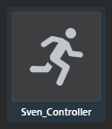
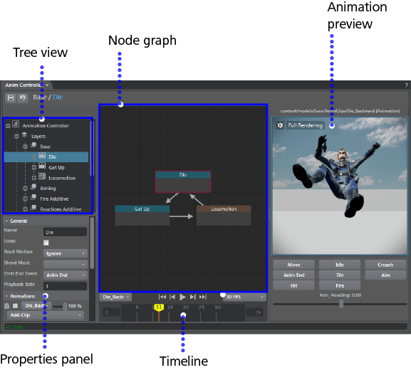

# Anim Controller Editor

- **Window > Animation > Anim Controller**
- Double-click an Animation Controller icon in the **Asset Browser**.

The **Anim Controller** Editor has these main areas:

## Tree view

The tree view lists all the different items that the controller knows about: layers, events, variables, constraint targets, constraints, and ragdolls.

##Node graph

The node graph gives you a visual representation of the states and transitions at the current level.

|  Node graph hotkeys    |
|----------------------------|-----------------|
| Group nodes | Ctrl + G |
| Ungroup nodes | Ctrl + Shift + G             |
| Frame Selected | F              |
| Frame All | A             |
| Cut | Ctrl + X             |
| Copy | Ctrl + C             |
| Paste | Ctrl + V             |

##Animation preview

The preview area lets you select events and see the effect on your character.

Click the Settings icon  to set the following:

- Root Motion
- Follow Camera
- Physics
- Reset Control Values
- Reset Preview

##Properties panel

The Properties panel at the bottom gives you controls for changing the properties of the currently selected object.

##Timeline

|  Timeline hotkeys    |
|----------------------------|-----------------|
| Play/stop animation | Spacebar |
| Previous Key | , (Comma)             |
| Next Key | Alt + ,              |
| Previous Frame | . (Period)             |
| Next Frame | Alt + .
|  Duplicate an event | Shift-drag

---
Related topics:
-	~{ Animation controllers }~
-	~{ Set up a character }~
-	~{ Set up an animation controller }~
---
