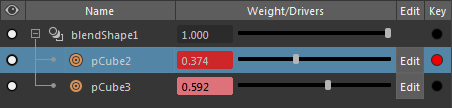

# Create and import blend shapes into Stingray

This method of shape animation lets you create target shapes directly on the base object without needing to create separate multiple target objects. This means less geometry in the scene to slow down the interaction time. You can also create multiple target objects that are duplicates of the base object, then modify the vertex positions on each one of the target objects into the forms you want. For example, you can use this method for facial animation, with each target object representing a different facial expression. For more information on this method, see [Create blend shapes using multiple target objects](http://help.autodesk.com/view/MAYAUL/2017/ENU/?guid=GUID-42114F0D-8F16-4365-A52C-E0FD70F40852). Your shape workflows can be performed in Maya or Maya LT.

## Create blend shapes using only the base object in your DCC

  1. Select the object you want to use for your blend shape.

  > **Tip:** This is the object to be deformed with the target shapes. When exporting to Stingray, it is recommended you use objects with low polygon counts.

  2. Open the **Shape Editor** (Windows > Animation Editors > Shape Editor).
  3. With your object selected, click **Create Blend Shape**.
  4. Do the following to add your targets:

    - Click **Add Target**.

    - Ensure the **Edit** button is red, letting you edit the target.

    - Use the **Sculpting Tools** to quickly reposition vertices, and change your object's shape.

	  - Click **Edit** when you are done editing your target layer to disable editing mode.

  5. Do the following to add animation to your target layers:

    - On the **Time Slider**, drag the time indicator to the desired frame.

    - In the **Shape Editor**, drag the **Weight/Drivers** slider to adjust the object's shape.

    - Click the red button next to **Edit** to add a key.

    

  6. Select your object, and then select **File > Send to Stingray > Selected**.
  7. In the window that appears, select a name and location for your exported file, and click **Export Selected**.

## Import blend shapes in Stingray

1. In Stingray, ensure the following options are selected in the **FBX Import** window that appears:

	  - Blend Shapes

	  - New or Update Skeleton: The name of your shape should appear in this field.

	  - Import Clips

	  - Create Animation Folder

2. Click **Import**.

	  When you initially import your object, the animation you applied in your DCC is not visible. You can add your animation in Stingray using an animation controller. See ~{ View animated blend shape targets in Stingray }~.

---
Related topics:
- ~{ Inspect blend shapes }~
- ~{ View animated blend shape targets in Stingray }~
---
