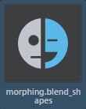
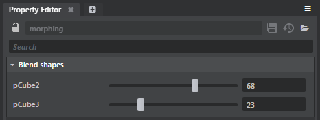

# Inspect blend shapes

After importing a blend shape from your DCC into Stingray, you can take a closer look at its contents, and adjust the influence of its morph targets.

## Inspect blend shapes

1. Import your blend shape from your DCC. See ~{ Create and import blend shapes into Stingray }~.
	 
	After importing, a new blend shape asset appears in the Asset Browser.

	
2. Select the blend shape asset.
	 
	Your targets appear in the **Property Editor**.

	
3. Move the sliders to adjust the amount of influence each of the target shapes has on your base object.
4. Click  to save your changes. Your changes are visible in the **Asset Preview**.

---
Related topics:
- ~{ Create and import blend shapes into Stingray }~
- ~{ View animated blend shape targets in Stingray }~
---
