# Set up a character

1. [Import the character mesh](#step1)
2. [Import animation clips](#step2)
3. [Specify the character root bone](#step3)
4. [Create the character's animation controller](#step4)
5. [Edit the character unit](#step5)
6. [Test play the level](#step6)

##Step 1. Import the character mesh 

(See also ~{ Import a character mesh }~.)

1. Create or open your project.

1. In the **Asset Browser**, create a new folder for your character mesh in the `content/models` folder.

	Example: `content/models/new_character`.

1. Click **Import**, then navigate to select the character mesh FBX file. See also ~{ Import an FBX file }~.

1. In the **Import FBX** options, enable **Animation** and select **New or update skeleton** for the **Skeleton**, then enter a name for this new character skeleton.

	This creates a Stingray skeleton for the character mesh that lets you apply animation clips later on.

## Step 2. Import animation clips 

(See ~{ Import animation clips }~.)

1. In the **Asset Browser**, browse to the directory you created for your character mesh.

	Example: `content/models/new_character/animations`.

1. Right-click in this directory and select **Import Asset**, then browse to select an animation clip and click **Open**.

1. In the **Import FBX** options, turn off **Unit Mesh**, then set the following:

	* Select **Target skeleton** as the **Skeleton**, and then select the skeleton of the character you created earlier.

		Example: `content/models/new_character/Sven`

	* Enable all options in the **Animation** section, including **Create Animation Folder**.

	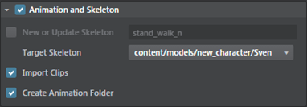

	**Tip:** You can also manually create an 'animations' folder before you import the clip, but this is an easy way to make Stingray do it for you. Either way, it's a good idea to organize the clips for a particular character in their own folder.

	The animation clip is imported, applied to the character, and starts to playback in the **Asset Preview** window.

## Step 3. Specify the character root bone 

1. In the **Asset Browser**, select the character's skeleton.

	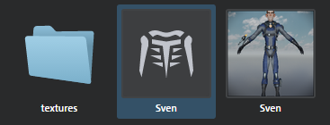

2. In the **Property Editor**, select a bone from the **Root Motion Bone** drop-down list.
	This is the bone where root motion is extracted for this character.

	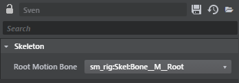

3. Save the skeleton unit in the **Asset Browser**. (Right-click the skeleton thumbnail, and select **Save**.)

	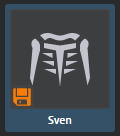

## Step 4. Create the character's animation controller 

###Create the controller

1. In the **Asset Browser**, right-click the character skeleton unit and select **Create Anim Controller**.

2. Enter a name for the Anim Controller when prompted and click **Ok**.

	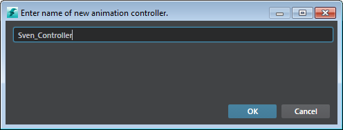

2. Double-click the Anim Controller object in the **Asset Browser** to open the **Anim Controller** Editor. (Or select **Window > Animation > Anim Controller**.)

	

1. Set up the preview environment in the **Anim Controller** Editor as follows:

  	* Select Animation Controller in the tree view.

		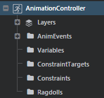

  	* In the options below the Animation preview pane, use the drop-down lists to select the skeleton, unit, and level you want to see in the preview.

		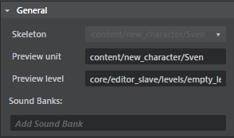

		* Above the preview panel, click the Settings icon, and set the options you want.

		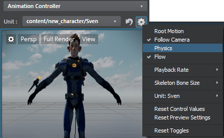

		For example, if you find that your character's physics cause them to fall through the floor, you can disable Physics in the preview.

### Set up layers and states

By default, one empty layer displays in the node graph area.

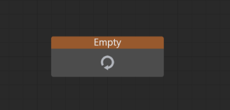

1. Select **Layers** in the tree view, right-click and select **Add Layer**.

1. Enter a layer name below the preview pane, for example "Locomotion_Layer", then click Add.

1. Add a state to the new layer (right-click and select **Add New State** > **Clip State**).

	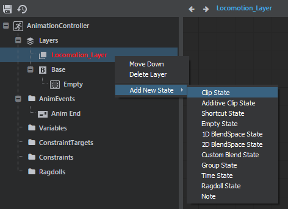

  * In the properties panel, click the Add clip field under **Animations**, then select from your list of imported animation clips.

	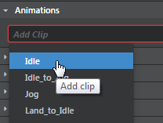

	The first state clip starts to playback in the timeline, and in the preview panel.

	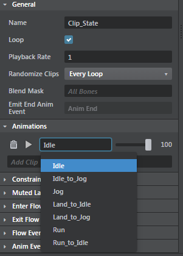

1. Repeat these steps to add a second state, or simply copy the first state, but change the animation clip.

###Create events to trigger each state

Now you'll want to add events to trigger each state.

1. In the tree view, right-click **Events** and select **Add New AnimEvent**, then rename the event in the properties panel.
 Example: move

1. Add a transition that is triggered by the move event:

- In the preview panel, drag from the 'idle' state to the 'walk' state.

	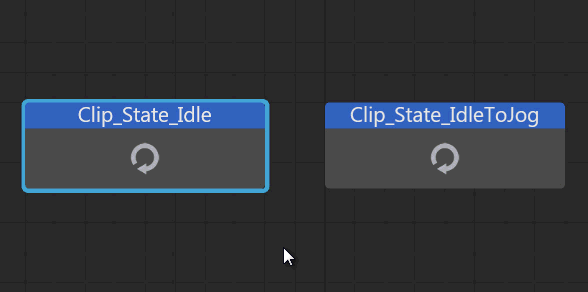

- In the properties panel, under Conditions, set the On property to Move. (The anim event you created earlier.)

1. Save the animation controller.

	> **Note:** Changes you make to the animation controller (such as adding an event or variable) only show up in the preview pane after you save the animation controller.

## Step 4. Preview the state machine animations 

As you select states in the **Anim Controller** Editor, use the preview pane on the right to preview the animation.

## Step 5. Edit the character unit 

1. In the **Asset Browser**, double-click the character unit to open the **Unit Editor**.

1. In the **Unit Editor**, add a mover (**Create > Mover**) and name it 'default'.

	Movers are used for collision and moving the unit. You can see the mover displaying on the character in the preview pane.

1. In the Unit Flow graph, add a node to drive the event you added.

	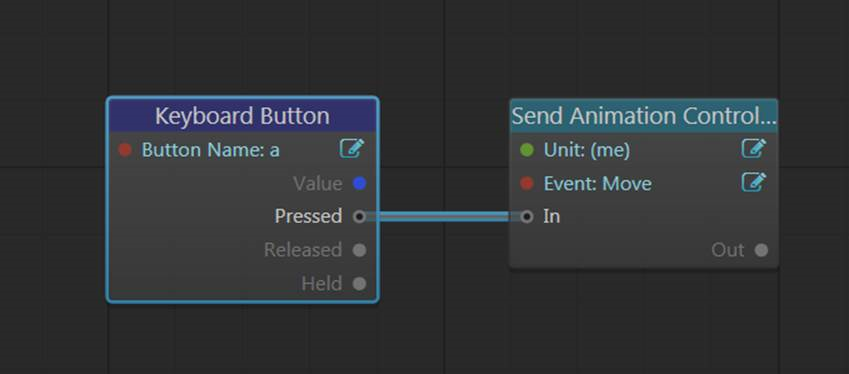

1. Save the unit (**File > Save**), then close the **Unit Editor**.

##Step 6. Test play the level 

1. Drag the character unit from the **Asset Browser** into the current level.

2. Press Play in the **Level Viewport** ~{ Toolbar }~.

	Now when you press a, the unit flow triggers the move event, and your character walks forward.

---
Related topics:
-	~{ Import a character mesh }~
-	~{ Set up an animation controller }~
-	~{ Import animation clips }~
-	~{ Test a level }~
---
