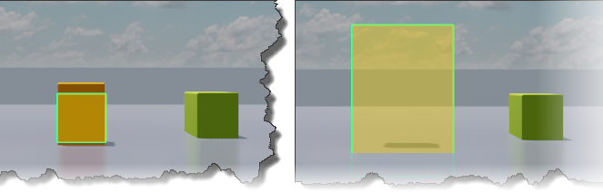

# Create occluder boxes

Occluder boxes are gizmo units that let you occlude objects that are behind other objects and not render them. For example, when rendering the interior of an architectural scene, you can prevent objects behind a wall or room from being displayed and hide them by occluding. Occluder box supports occluding of shadow casting of light if the occluder is placed between the light source and the object. Occlusion culling can give you significant performance improvements at it lets you avoid rendering shadows and objects that give no visual impact to your final rendered frame, allowing you to spend hardware resources on rendering other more significant objects and effects.

Occlusion culling also occludes sections of terrain and particle effect systems and is a great tool to optimize rendering whenever time is spent rendering objects that are not seen in the viewport.

For occlusion culling, Stingray uses frustum culling and first performs sphere culling to check the frustum plane against the sphere radius of objects in the world space. Objects passing the sphere test go through object-oriented bounding box culling (OOBB) where the bounds of the object are tested against the frustum plane. Finally, objects that pass the frustum - OOBB testing is rendered. For more details on frustum culling in Stingray see [here](https://gamedev.autodesk.com/blogs/1/post/353597490642337181).

You should consider placing occluder boxes with relation to larger occluding surfaces in your scene such as inside walls, inside ceilings and floors and inside larger buildings or blocking objects in your outdoor scenes. Always consider the viewpoint of your user and the lights inside your scene to place occluders in the most optimal way to avoid rendering objects that will not be seen. You can preview the occluder box behavior inside the level editor by turning off gizmos and observing the occlusion behavior.

You can also use a regular unit mesh as an occluder by opening it in the ~{ Unit Editor }~ and enabling the Occluder option for the mesh in the Properties panel. Though you can turn units into occluders, manually placing occluder boxes is better, since in Stingray only objects fully covered by one of the sides of the bounding box of an occluder are occluded. Objects covered by two separate occluder sides but not fully covered by one single occluder side will still be rendered. Also, Stingray considers only the largest occuluders in a scene. If the scene has many small occluders, Stingray considers only a few and not all of them.

## Create an occuluder box

1. Do either of the following:

  	- From the main menu bar, select **Create > Occluder Box**.
  	- In the **Create** window (**Window > Create**), switch to **Helpers** tab and select Occluder Box from the **Rendering** section.

2. In the level viewport, place the occluder box in front of the unit to cull so that one side of the occluder box covers the mesh of the unit.

  	The occluder box is a transparent yellow box and is invisible when you run the project.

3. Adjust the scale of the occluder box to fully cover the unit.  As you adjust the box to cover the bounds of the unit, the unit is culled and disappears from the viewport. Along with the main occluded unit, other objects get culled if they are within the bounds of the occluder box.

  	

4. On test playing the level, the culled units are invisible if they are within the range of the camera.
