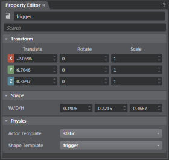

#Trigger properties

The following properties display in the ~{ Property Editor }~ when you create or select a trigger volume.

<dl>

<dt>Name</dt>
<dd>Name of the trigger. Name must be unique.

  > **Note:** Stingray gives the trigger a unique name when you create it, and prevents you from changing the name to an existing name.

</dd>

</dl>

###Transform

<dl>

<dt>Translate x/y/z</dt>

<dd>Numeric Position (in grid units) of the trigger.</dd>

<dt>Rotate x/y/z</dt>
<dd>Angular position (in degrees) of the trigger.</dd>

<dt>Scale x/y/z</dt>
<dd>Size multiplier.</dd>

</dl>

###Shape

<dl>

<dt>W/D/H</dt>
<dd>Sets the width, depth and height of the trigger.</dd>

<dt>Visible</dt>
<dd>Toggles whether the trigger renders. </dd>

</dl>

###Physics

<dt>Material</dt>
<dd>Sets the material template for the trigger.</dd>

<dt>Shape Template</dt>
<dd>Sets the type of actor for the trigger. For more information on physics actors, see ~{ Basic physics concepts }~.</dd>

</dl>

---
Related topics:
-	~{ Create a trigger }~
-	'~{ Example workflow: Trigger a door opening }~'
---
