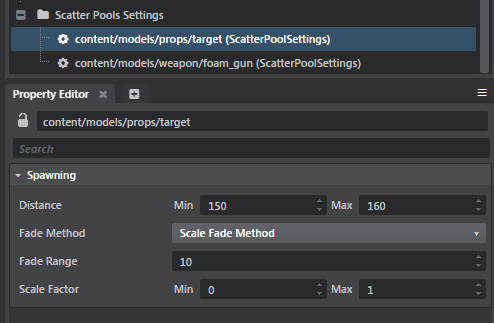

# Scatter Pool Settings

When you scatter a unit, a scatter pool is created. Scatter pools let you make changes to all of the scatter data in your project at once. The Scatter Pool settings let you control how and when the scattered units are rendered. Similar to Level of Detail (LoDs), you can make your scattered units grow as you move the camera closer, and fade as you move the camera farther away.

Select the scatter pool in the **Explorer** > **Scatter Pool Settings**.

> **Note:** If you have two scatter brushes that use the same unit, only one scatter pool setting is created. If you have two units associated with one brush, two scatter pool settings are created.

<dl>

<dt>Distance</dt>

<dd>Scattered units start to fade out at the **Min Distance** and continue to fade out for the distance set in the **Fade Range**. Scattered units start to fade in at the **Max Distance** and continue to fade in for the distance set in the **Fade Range**.</dd>

<dt>Fade Method</dt>

<dd>Lets you determine how your scattered units fade. </dd>

<dt>Fade Range</dt>

<dd>Determines the distance (in meters) that units fade before reaching their **Min Scale Factor** or **Max Scale Factor**.</dd>

<dt>Scale Factor</dt>

<dd>When you move your camera away from the scattered units, they fade until they reach their **Min Scale Factor**. When you move your camera closer to the scattered units, they grow to their full size, which is set by the **Max Scale Factor**.</dd>

> **Note:** When scattered units reach their Min Scale Factor and are removed from the scene, any spawned particle effects associated with the units are also removed.
