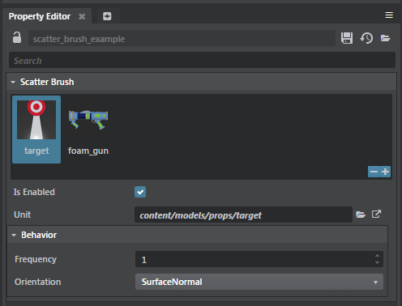
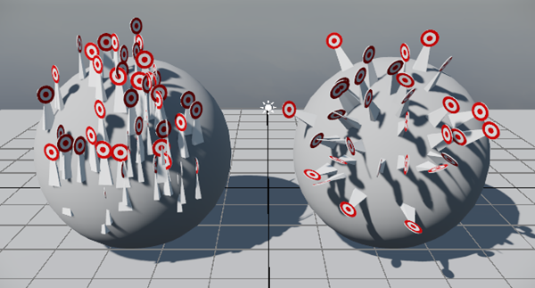

# Scatter Tool Properties

When you create a new Scatter Brush, the following properties appear in the Property Editor. See ~{ Scatter Tool }~ and ~{ Paint with the Scatter Tool }~ for more information.

 </dd>

<dl>

<dt>Is Enabled</dt>

<dd>When on (default), enables the scatter tool in your project. </dd>

<dt>Unit</dt>

<dd>Displays the path of the unit you've selected to scatter.</dd>

<dt>Frequency</dt>

<dd>Sets the weight of the currerntly selected unit in relation to the other units associated with your scatter brush.</dd>

<dt>Orientation</dt>

<dd>Lets you control how scatter is painted on objects. The image below shows the two types of orientation. When **SurfaceNormal** (right image) is selected, the scatter follows the normals of the object. When **WorldUp** is selected (left image), the scatter follows the world's normals.
 
 </dd>
