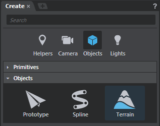
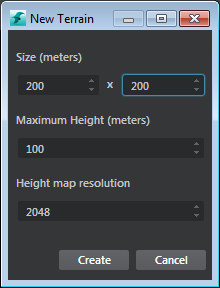
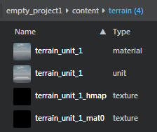
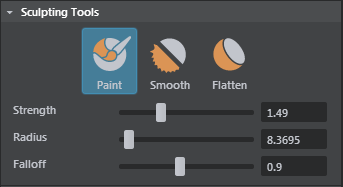
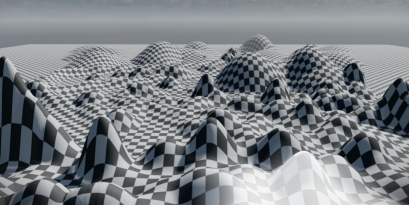

#Create terrain

The Stingray terrain tools let you create and edit terrain meshes by sculpting, and by importing and exporting terrain files that you work on in other applications.

**To create terrain:**

1. Do one of the following:

  - From the main menu bar, select **Create > Terrain**.
  - Right-click **Asset Browser** and select **Create Terrain**.
  - From the **Create** panel (**Window > Create**), select the **Objects** category, then select **Terrain** from the **Objects** sub-category.

  	

2. In the **New Terrain** options that appear, set the following and click **Create**:

 	 

    <dl>

    <dt>**Size**</dt>
    <dd>Determines how large the terrain appears in the level, measured in meters. The maximum size allowed is 16000 x 16000 in meters.</dd>

    <dt>**Maximum Height**</dt>
    <dd>Determines the maximum height its possible for you to paint. This value comes into play later on as you paint to add peaks to the terrain. The maximum height allowed is 10000 meters.</dt>

    <dt>**Height Map Resolution**</dt>
    <dd>Alters the actual resolution of the backing textures for the height and material map. This affects the level of detail at which you can paint.</dd>

    </dl>

3. In the file browser that appears (**Save Terrain Unit**), enter a name for the terrain and click **Save**. We recommend that you also create a new folder to contain the terrain units in your project '/content' folder.

Stingray creates a terrain plane unit in the level, with a default checkerbox material assigned. This default material (core/stingray_renderer/shaders/terrain_basic) sets up the connection between the material map and actual textures. In the **Asset Browser**, you can see the terrain unit, its material, and the associated textures.

New terrain **Sculpting Tools** display in the **Property Editor**, and you can immediately start to paint the height and material maps in the **Level Viewport**. The terrain plane updates as you sculpt.

 

| Sculpting Tools hotkeys  |  |
| ------------- | ------------- |
| Enter paint mode| B |
| Brush radius  | B + drag |
| Brush falloff  | N + drag |
| Brush strength  | M + drag |
| Lower terrain (only in paint mode) | Ctrl + drag |

  > **Note:** With terrains if you do a frame all (A) or frame selection (F) the view does not focus the entire terrain, instead it shifts toward a different position based on camera rotation.

##Export a sculpted mesh as a height map
You can export the sculpted terrain mesh as a .dds or .raw file. In the **Property Editor**, under Height Map, click **Export** and enter a name and the file type to save the terrain mesh.

To edit the material for the terrain:

1. Select the associated material in the **Asset Browser**.
  The **Property Editor** displays properties of the 'terrain_basic' material.
2. Click **Make Unique**.
