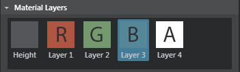
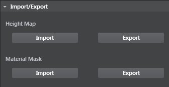

#Terrain properties

The following properties display in the ~{ Property Editor }~ when you create or select a terrain unit.

###Transform

<dl>
<dt>Translate x/y/z</dt>
<dd>Numeric position (in grid units) of the terrain.</dd>

<dt>Rotate x/y/z</dt>
<dd>Angular position (in degrees) of the terrain.</dt>

<dt>Scale x/y/z</dt>
<dd>Size multiplier.</dd>
</dl>

###Materials

The material resource for the terrain.

###Lightmap unit settings

Enables or disables light mapping.

###Sculpting Tools

 

 There are three brushes available:

 <dl>
  <dt>Paint</dt>
 <dd>When **Height** map is the selected **Material Layer**, this brush raises the terrain. Ctrl + drag to lower the terrain.

 When you select a material map channel under **Material Layer**, this brush adds or subtracts from that channel.
</dd>

 <dt>Smooth</dt>
 <dd>This brush smooths out the terrain. For height maps this makes slopes and sharp edges smoother. For material map channels this makes differences in the material map smoother.
 </dd>

 <dt>Flatten</dt>
 <dd>With the height map paint mode selected, dragging this brush over the terrain  samples the height under the pencil and flattens nearby terrain to the same height.

 For material map channels the effect is similar, the color under the cursor smudges out as you drag.</dd>

 </dl>

 | Sculpting Tools hotkeys  |  |
 | ------------- | ------------- |
 | Enter paint mode | B |
 | Change brush radius  | B + drag |
 | Change brush falloff  | N + drag |
 | Change brush strength  | M + drag |

###Material Layers

<dl>

<dt>Height</dt>
<dd></dd>

<dt>R, G, B, A</dt>

<dd>Masks. Painting on these 4 layers lets you blend multiple textures onto one terrain mesh. Select a layer, then paint where you want to use that texture.</dd>

</dl>

###Undergrowth

The undergrowth properties let you quickly create instances of simple objects you want strewn around the ground surface, such as rocks, grass, or bushes, by painting directly into any of the RGBA layers. This lets you quickly populate your environment with different objects.

Undergrowth objects display based on camera distance, filling in when the camera is close to the layer, and removing objects when the camera is further away. Use the **Density** property to adjust the density of objects in  the undergrowth settings.

<dl>

<dt>Mesh</dt>
<dd>For a selected channel, lets you specify objects to be instanced across the terrain plane geometry. Click + to open the **Content browser** and select a lightweight mesh for instancing.</dd>

<dt>Density</dt>
<dd>Determines how heavily the selected geometry is instanced on the terrain. </dd>

</dl>

###Import/Export

<dt>Height Map</dt>
<dd>Click to **Import** or **Export** the associated height map texture file for the terrain mesh.</dd>

<dt>Material Mask</dt>
<dd>Click to **Import** or **Export** the associated height map texture file for the terrain.</dd>

</dl>

---
Related topics:
- ~{ Import a height map for terrain }~
---
