#Story Editor

- **Window > Story Editor**

The **Story Editor** is a tool for creating simple animation on objects/units and entities within a level. You can add units and entities to Story and animate their transforms and other parameters using keyframe animation. (You cannot use animation clips in Story.) See also ~{ Create simple animations with the Story Editor }~.

This editor consists of the following main areas:

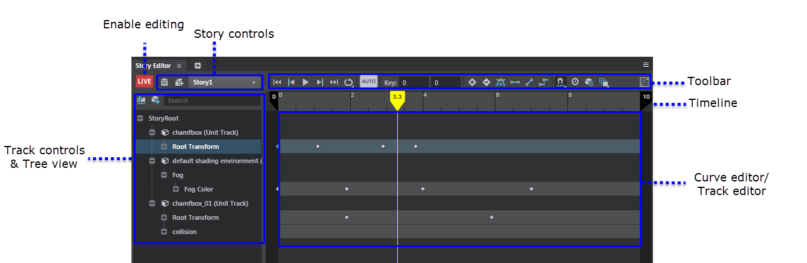

Refer to the sections below for more detail on each area.

##LIVE button

Click to toggle Story mode. When on, the **Story Editor** is "live" so you can start to add keyframe animation on selected objects.

  > **Important:** When Story mode is on, changing the position of the unit in the level has no effect. To edit the position of the unit in the level again, exit Story mode. (Click LIVE to toggle the mode on and off.)

You can still select, move, delete, or modify key values when the **Story Editor** is not live.

  > **Note:** As you animate units in the **Story Editor**, the animation plays back only in the **Level Viewport**, it cannot playback on connected devices.

##Story controls

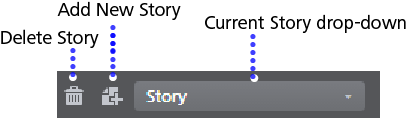

Click  to add a new Story to the editor. If you select a unit or entity before clicking , Stingray automatically adds the unit or entity to a new level object track within the story.

When working on multiple stories within a level, use the Current Story drop-down to switch between them.

##Toolbar

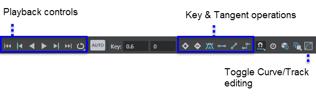

The **Story Editor** toolbar includes the following:

**Playback Controls**

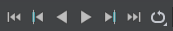

Use the playback controls to preview animations in the **Level Viewport**, as you edit the unit animation in the **Story Editor**.

**Snap**

Enables snapping to frames or seconds in the timeline.

**Autokey**

When on, after you keyframe an object once, the object is automatically keyframed every time you manipulate it in the **Level Viewport**.
 

**Time mode**

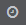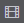

Toggle the timeline to display seconds, or frames.

**Edit key fields**

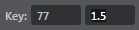

Manually enter time and value for a selected keyframe.

**Key & Tangent options**

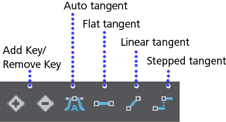

**Story Selection mask**

Masks selection so that you can select only objects in the current story.

**Onion skinning**

Toggles the display of ghosting on selected units. Right-click to specify whether to ghost **Everything**, or only **Selected units**.

To access additional **Onion Skinning Settings** (including color) in the **Properties** panel, select a `StoryRoot` in the **Story Editor** tree view, or in the main **Explorer** panel.

**Curve editor/Key editor**

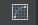

Use the curve icon in the toolbar to switch between the different editing views in this area.

Curve editing mode:

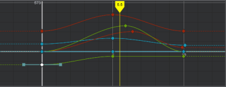

   > **Tip:** Select keys on the same curve and enter a value in the edit key field on the toolbar to edit multiple keys at once.

Key editing mode:

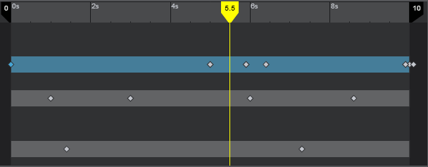

##Timeline

- Use the snapping icon  to enable snapping to seconds or frames.

- Use the clock icon  to switch between showing seconds or frames on the timeline.

##Track options & Tree view

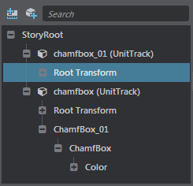

Use the tree view to browse and select stories, tracks, and properties for keyframing. The tree view includes a small tool bar with a search panel, and the following options for adding tracks:

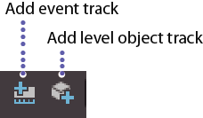

**Add level object track**

Use level object tracks to organize the keyframe animation for each unit or entity added to the story. A unit track is automatically created if you select an object before clicking .
 
An entity track is automatically created if you select an entity before clicking .

Right-click level object tracks to add more properties for animation, including the object's material properties.

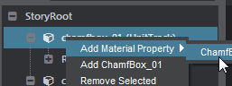

**Add event track**

Add event tracks and set keys that you want to expose in the **Level Flow** Editor. You can use keys on event tracks to trigger anything in the level flow. (Play a sound, trigger a particle effect, set up a camera switch, and so on.)

To access the event output in Flow after you create a key in Story, add a **Level > Level Story** node, then click `Story`.

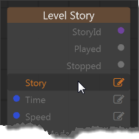

In the pop-up window that appears, select the Story containing the event track you want.

This adds the event track parameters to the Story node, so you can then connect the event output to trigger something else.

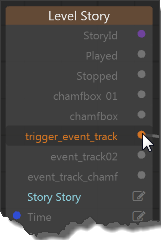

---
Related topics:
-	~{ Story Editor hotkeys }~
-	~{ Create simple animations with the Story Editor }~
---
