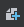
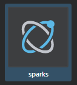
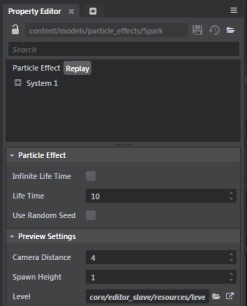
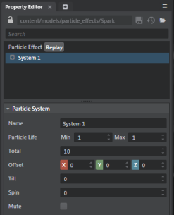
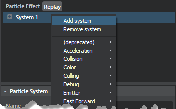

# Create and edit particle effects

>  For video tutorials on creating particle effects, see <a href="http://area.autodesk.com/learning/creating-particle-effects-in-stingray" target="blank">Particle Effects in Stingray</a>.

The **Particle Editor** Tool (**Window > Particle Editor**) lets you create new particles, modify them and preview the effects in the viewport within the tool. You can open and modify multiple particles at the same time, view History  of actions performed, and use the Respawn  and Pause/Resume  icons to respawn the particle effect and pause/resume the particle effects preview.

## Create a particle effect

1.	Select **Window > Particle Editor** to launch the **Particle Editor**.

    The **Particle Editor** opens with a default, untitled particle effect ready for you to modify.
2.	Modify the default particle effect by editing its properties.(See ~{ Particle system properties }~.)
3.	Click **Save**  to assign a name and save the effect to the desired location in your project.

	This creates both a particle effect system, and a related particle material.

**Other ways to create particle effects:**

-	To create another particle effect, click **New**  to open a new tab with an untitled particle effect in the **Particle Editor**.

-	You can also use the right-click menu option in the **Asset Browser** to create a new particle effect:

	1.	In the **Asset Browser**, navigate to your project /contents folder and create a new sub-folder for your particle effects.

	2. Right-click in file view area of the Asset Browser, select **Create > Particle Effect**, and enter a name for the new particle effect.

		A particle asset and a particle material are created in the Asset Browser.

	3. Select the particle effect asset and either double-click or in the **Property Editor**, click **Open in Editor**. The particle effect asset launches in the **Particle Editor**.

		

## Edit a particle effect

The main way you'll work with particles is by modifying the properties of the particle system. Particle systems are simply a group of commands that guide each of your particles from their birth to their death.

The default particle system is called System 1, and you can add and remove controllers to any system to customize the particle effect. Each particle effect can have multiple systems, and each system can have multiple controllers.

1. Select a particle effect asset in the **Asset Browser** and double-click to open it in the **Particle Editor**. You can also open a particle effect asset using the Open icon  in the **Particle Editor**.

	The particle system properties are displayed in the **Particle Editor**.

	

2. Select System 1.

	

	Selecting **System 1** shows you the general, overall properties of this particle system.

	In the default system properties, you can edit the system name, set the particle life span (min/max values) in time in seconds, or control the spawn position with the **Offset**, **Tilt**, and **Spin** properties.

3. See the components of System 1.

	By default, this system contains Emitter:Rate, Size, Color, Velocity:Box and Billboard Visualizer components. The Billboard Visualizer uses the custom particle material created for the particle effect. Replace this material with a material graph (containing a Particle Base shader node) of your choice.

	

	>**Note:** If you delete the Billboard Visualizer component, the particle effect won’t display. You can use a non-rendering particle system to act as a trail spawner for other particle systems.

4. Select each component to view the properties available for editing.

>**Tip:** Reorder the particle effects by dragging and dropping the systems in your particle effect, and copy and paste the controllers and systems using the right-click **Copy**, **Paste** context menu options or hotkeys (Ctrl + C, Ctrl + V).

## Add additional systems to a particle effect

-	Right-click the particle system (System 1) and select Add System.

	

## Add controllers to a system

- Right-click the system root and select the component you want to add.

## Remove controllers from a system

-	Right-click and select **Remove Controller**.

> **Tip:** When working with particle effects, click the gear icon  in the **Asset Preview** of the **Particle Editor** and select **Update Mode > Always**.

---
Related topics:
-	'~{ Example workflow: Create a particle effect }~'
---
