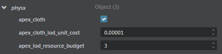

# Enable Apex Cloth

**To enable apex cloth in a project**

2. In the Stingray Editor, load a scene with a cloth simulation.

3. In the viewport, select an object with cloth and then open the settings.ini file.

4. Turn on apex_cloth.

	

	You can configure the cloth simulation budget using the attributes in the settings.ini file. See ~{ Stingray engine settings.ini file reference }~ for more information.

5. Restart the editor engine (Ctrl + F6).
 
Your cloth simulation plays in the viewport.

---
Related topics:
- ~{ Stingray engine `settings.ini` file reference }~
---
