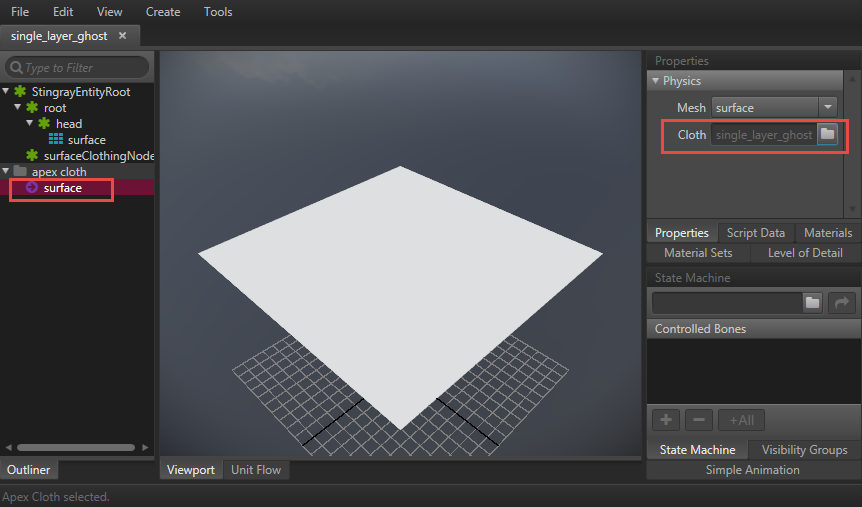

# Enable APEX Cloth

**To enable APEX cloth in a project**

2. In the Stingray Editor, load a scene with a cloth simulation or import an FBX with APEX cloth.

3. In the viewport, select an object with cloth and then select the settings.ini file.

4. Turn on apex_cloth in the **Property Editor**.

	

	You can also manually configure the cloth simulation budget using the attributes in the settings.ini file. See ~{ Stingray engine settings.ini file reference }~ for more information.

5.  Associate APEX cloth defintion to the unit's meshes.

	1. Open the selected object in the **Unit Editor**.
	2. Select a mesh in the Unit Editor Outliner to bind to an APEX cloth.
	3. Either select Create or right-click the mesh to select **Add APEX Cloth Resource**.

		A cloth resource is created and is visible under the 'apex cloth' section in the Outliner.
	4. Select the cloth resource and in the Properties Panel, browse for the corresponding cloth definition (.apx files) to bind to the mesh.

		
	5. Repeat steps 2-4 for each mesh that should be bound to an APEX cloth.

6. Restart the editor engine (Ctrl + F6).
 
Your cloth simulation plays in the viewport.

---
Related topics:
- ~{ Stingray engine `settings.ini` file reference }~
---
