#Example workflow: Create a particle effect

##Step 1. Create the first particle effect

1.	In the **Asset Browser**, navigate to your project /contents folder and create a new sub-folder for your particle effects. For example, name the folder 'particle_effects'.

2.	 Right-click in file view area and select **Create > Particle Effect**, or click the **Create Asset** icon  and select **Create Particle Effect**.

3.	Enter 'sparks' as the name for the new particle effect.

	A particle asset is created in the **Asset Browser**. A particle material is also created for the particle effect in the Asset Browser.

	

	You now have your first particle effect asset. Now, lets make it do something.

##Step 2. Modify properties of the particle system

Particle systems are simply a group of commands that guide each particle from birth to death.  To begin, lets take a look at the default system.

1.	Select the particle effect asset and double-click to view its properties in the **Particle Editor**, then select System1.
	The general properties of this system display.

3.	Since we only need an Emitter and  Size component for the particle effect to work properly, right-click **Billboard Visualizer** and select **Remove Controller**.

	The System now has only three components **Emitter:Rate**, **Size**, and **Color**.

4. Select the **Emitter:Rate** component to view those properties.

	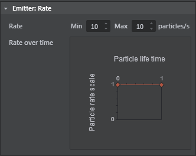

	For now the default properties are fine.

5. Select the **Size** component, change the Min value to 1, and the Max value to 2.

6. In the ~{ Asset Preview }~ window, click the gear icon   and select **Update Mode > Always**.
	(This is best when working with particle effects.)

	Right now the system is rapidly creating particles, but since they have no motion we only see a single square pixel. In the next steps, you'll add more components to make the effect more interesting.

	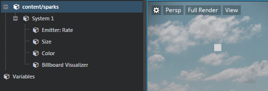

##Step 3. Add components to customize the effect

1. Right-click on the system and select **Acceleration > Gravity**.

	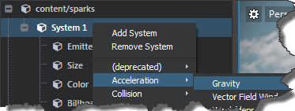

	In the **Asset Preview**, you can see some basic falling motion from your particle effect.

	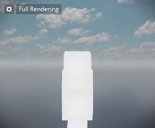

2. Right-click the system and select **Velocity > Box**.

	This randomizes the effect with some box motion.

3. Adjust the **Veloctiy:Box** properties to make the Minimum X, Y, Z values -3, and the Maximum values 3.

	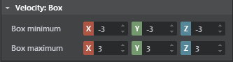

	This gives us a basic, proper particle effect. In the next steps, we'll tweak more parameters.

	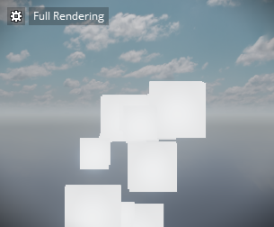

##Step 4. Adjust component properties

1. Select the **Size** component, and for the **Initial Size** property, change the **Min** value to .25, and **Max** value to 1.

2. Adjust the particle scale over life time graph to go from 0 to 1.

	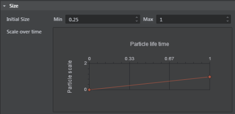

	> **Tip:** Increase the width of the **Property Editor** to see greater detail of the property graph.

	The particle effect preview should now look similar to the following:

	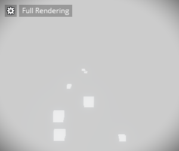

3. Select the **Color** component.

4. Double-click the small white square below **Color Gradient**, then choose a light blue color from the **Color Picker** and click **Ok**.

	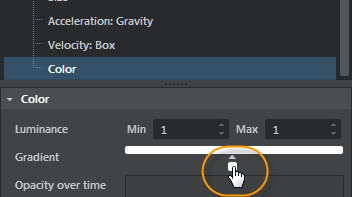

5. Click to the left of the now blue square to add another color to the gradient bar, and keep this one white.

	

6. Slide the light blue square to the right.

	> **Tip:** To remove a color, right-click the square.

	Lastly, we'll make the sparks fade out over time.

7. Adjust the **Particle Opacity** graph by dragging the end-time point down to 0.

	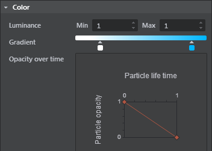

	The particles look similar to the following in the **Asset Preview**:

	

##Step 5: Save the effect

In the **Particle Editor**, click the Save icon  .

##Step 6: Place the effect in your level

Place the particle effect in your level using the Place tool  or by dragging the asset into the **Level Viewport**.

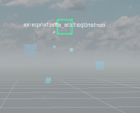

---
Related topics:
- ~{ Create and edit particle effects }~
- ~{ Particle system properties }~
---
