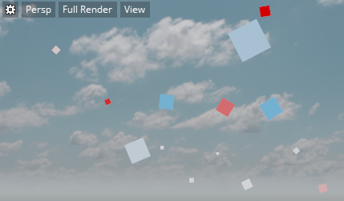

#Example workflow: Create a particle effect

##Step 1. Create the first particle effect

1.	Open **Particle Editor** (**Window > Particle Editor**), which creates a temporary particle effect.
2.	Click **Save**  to name and save the particle effect.

##Step 2. Modify component properties of the particle system

Particle systems are simply a group of commands that guide each particle from birth to death.  To begin, let's take a look at the default system.

1.	Select System 1 to view the general properties of this system.

2.	Select the **Size** component, and for the **Initial Size** property, change the **Min** value to 0.01, and the **Max** value to 0.05.

3. Adjust the particle scale over life time graph to go from 0 to 1.

	

	> **Tip:** Increase the width of the **Property Editor** to see greater detail of the property graph.

4. In the ~{ Asset Preview }~ window, click the gear icon   and select **Update Mode > Always**.
	(This is best when working with particle effects.)

5. Select **Velocity:Box**, which randomizes the effect with some box motion.
6. Adjust the **Veloctiy:Box** properties to make the Minimum Z values 0.

	

	This makes the particle effect spawn particles in the upward direction.

7. Select the **Color** component.

8.	Click the small white square below **Color Gradient**, then choose a light blue color from the **Color Picker** and click **Ok**.

	

9. Click to the left of the now blue square to add another color to the gradient bar, and keep this one white.

	

10. Slide the light blue square to the right.

	> **Tip:** To remove a color, right-click the square.

	Lastly, we'll make the sparks fade out over time.

11. Adjust the **Particle Opacity** graph by dragging the end-time point down to 0.

	

	The particles look similar to the following in the **Asset Preview**:

	

##Step 3. Add components to customize the effect

1. Right-click on the system and select **Rotation > Spin**.

	In the viewport, you can see your particle effect spinning around.

2. Right-click the system, select **Copy** and then again right-click to select **Paste**.

	This creates a copy of the system in the editor.

3.	Rename the newly created System 1 to System 2.
4.	Change the color of the System 2 from light blue to red.

	The particles now look similar to the following in the viewport:

	

##Step 4: Save the effect

In the **Particle Editor**, click the Save icon  .

##Step 5: Place the effect in your level

Place the particle effect in your level using the Place tool  or by dragging the asset into the **Level Viewport**.

---
Related topics:
- ~{ Create and edit particle effects }~
- ~{ Particle system properties }~
---
