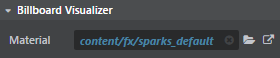

# Particle system properties

When you select a Particle Effect in the **Asset Browser**, the following properties display in the **Property Editor**.

Click Replay at any time to view the effect of your changes as you edit the properties of the particle effect system.

##System properties:
<dl>
<dt>Name</dt><dd>Lets you change the default name of the system, which is useful for organization when you have multiple particle effects in your level.</dd>
<dt>Particle Life </dt>
<dd>Set Min/Max values to define the particle lifespan (time in seconds).</dd>
<dt>Total</dt>
<dd>Set the total number of particles to create for the particle system. This value limits the number of particles allowed to spawn in the system.</dd>
<dt>Offset</dt>
<dd>Enter X, Y, Z co-ordinates to control spawn position.</dd>
<dt>Tilt</dt>
<dd>Enter a value to control how much tilt when spawned.  </dd>
<dt>Spin</dt>
<dd>Enter a value to control how much spin when spawned.  </dd>
<dt>Mute</dt>
</dl>

Within the System properties, you can also set the following:

###Emitter: Rate properties

These properties define how many particles to spawn over time.

Set the rate Min/Max values, and use the small graph denoting rate over (particle life) time.

###Billboard Visualizer properties

<dl>
<dt>Material</dt><dd>The material map for the billboard.

By default, the billboard uses core/stingray_renderer/shaders/particle_default.

Click the Goto Resource icon, then click **Open Shader Graph** to edit the shader graph.

Refer to the [Stingray Shader Node Reference](../../shaders_ref/index.html) for details on the new nodes added to support the physically based materials for particles, including **Output > Particle Base**, **Particles > Billboard Position**, **Particles > Billboard Rotation**, and **Particles > Billboard Size**.
</dd>

</dl>

###Size properties
<dl>
<dt>Initial Size</dt>
<dd>Set Min/Max values for the size of the particle.</dd>
<dt>Scale over time</dt>
<dd>Adjust the graph to change the size of the particle over its lifetime.</dd>
<dt>Use system lifetime for scale</dt>
<dd>Enable to spawn and scale the particle separately from its general attributes</dd>
<dt>Control height separately</dt>
<dd>Enable to control the height of the particle.</dd>
<dt>Initial Height </dt>
<dd>Set Min/Max values for the height of the particle.</dd>
<dt>Scale over time</dt>
<dd>Adjust the graph to change the height of the particle over its lifetime.</dd>
<dt>Use system lifetime for scale</dt>
<dd>Enable to spawn and change the height separately from its general attributes.</dd>
</dl>

###Color properties

<dl>
<dt>Luminance</dt>
<dd>Set Min/Max values to add brightness to the particle.</dd>
<dt>Gradient</dt>
<dd>Double-click the white square to change the color of the particle. Click below the Gradient to add white squares and add different colors for the particle.</dd>
<dt>Opacity over time</dt>
<dd>Adjust the graph to control the opacity of the particle to achieve a fade in and out effect.</dd>
</dl>

##Particle Effect properties

<dl>
<dt>Infinite Life Time (on/off)</dt>
<dd>Enable for the particles to live infinitely.</dd>
<dt>Life Time</dt>
<dd>If Infinite lifetime is not selected, enter a value as the lifetime of the particles spawned.</dd>
<dt>Use Random Seed</dt>
<dd>Enable for the particles in the system to be generated randomly.</dd>
</dl>

##Preview Settings properties

<dl>

<dt>Camera Distance</dt>
<dt>Spawn Height</dt>
<dt>Level</dt>

</dl>

## Particle system components

Right-click a particle system in the **Property Editor** to add the following components from the pop-up menu:

### Acceleration
- Gravity
- Vector Field Wind
- Wind (deprecated)

### Collision
- Grid Sampled (deprecated)
- Plane (deprecated)
- Query
- Result

### Color
- Color
- Distance Fade

### Culling
- Disable

### Debug
- Draw

### Emitter
- Burst
- Rate

### Fast Forward
- When Static

### Material

- Shadow Caster

> **Note:** The following components previously available under the Material category are now deprecated, and listed under the (deprecated) category.

> - Billboard Material (use Visualizer > Billboard)
> - Pivot
> - UV Animation
> - UV Tile

### Position Control
- Ray
- Spiral

### Position Init
- Box
- Cylinder
- Local Space
- Mesh
- Sphere
- Warp Box

### Rotation
- By Velocity
- Align Direction Box
- Align to Velocity
- Face Velocity
- Facing Direction Box
- Random
- Spin

### Size
- Size by Life
- Size by Variable

### Sort
- Billboards

### Spawn
- Trail

### Vector Language
- Initializer
- Simulator

### Velocity
- Box
- Cone
- Cylinder
- Scale

### Visualizer
-  Billboard
- Light
- Mesh
