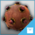

# Creating Gameplay

With Stingray, you can set up interactive gameplay using Flow visual programming, and Lua scripting. Topics in this section introduce you to both.

>  A great way to get started with interactive authoring is to check out some real working game projects built in Stingray. These kits are built mostly in Flow, so they demonstrate the kind of things you can accomplish without needing to write a ton of custom code.

<table class="not-ruled"><tr><td>

</td><td>
Want to play around with a shooter game implemented entirely in Flow? Open the Top-Down Space Shooter project from the **Online Projects** tab of the **Project Manager**, or [download the project here](https://gamedev.autodesk.com/stingray/plugins/space_shooter_gamekit)!
</td></tr>
<tr><td>

</td><td>
Capture the stars while you leap to new levels in this side-scrolling platformer! Open the Nora project from the **Online Projects** tab of the **Project Manager**, or [download the project here](https://gamedev.autodesk.com/stingray/plugins/nora_gamekit)!
</td></tr>
<tr><td>

</td><td>
The Gears game shows off physics-based gameplay with a musical touch. Open it from the **Online Projects** tab of the **Project Manager**, or [download the project here](https://gamedev.autodesk.com/stingray/plugins/gears_gamekit)!
</td></tr>
</table>
