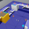

# Gameware Navigation

Autodesk Gameware Navigation is a middleware for Artificial Intelligence (AI) in 3D video games and simulations: it helps your game-controlled characters (NPCs) find and follow paths from place to place in the game world, avoiding collisions with each other and with other dynamic obstacles; and it provides spatial analysis tools for getting information about the game world.

The Gameware Navigation plug-in adds the following capabilities to Stingray:

*	You can automatically create navigation meshes for your levels in the Stingray editor.
*	You can spawn bots in your game at runtime, and make them find and follow paths from place to place in the level.
*	In your Lua or Flow code, you can conduct high-performance spatial queries against the navigation data, and use the results to drive gameplay.

<table class="not-ruled"><tr><td>

</td><td>
The best way to learn about Navigation in Stingray is to get your hands on the example projects for Flow and Lua. Open them from the **Online Projects** tab of the **Project Manager**, or [download the projects here](http://www.autodesk.com/stingray-online-projects)!
</td></tr></table>

## For more information

For more information about Gameware Navigation, see:

*	[The Autodesk Gamedev portal](http://gamedev.autodesk.com)
*	[The complete Gameware Navigation documentation](http://help.autodesk.com/view/GWNAV/2016/ENU/).
