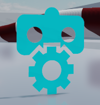
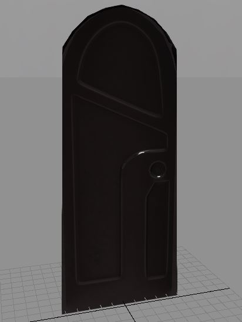
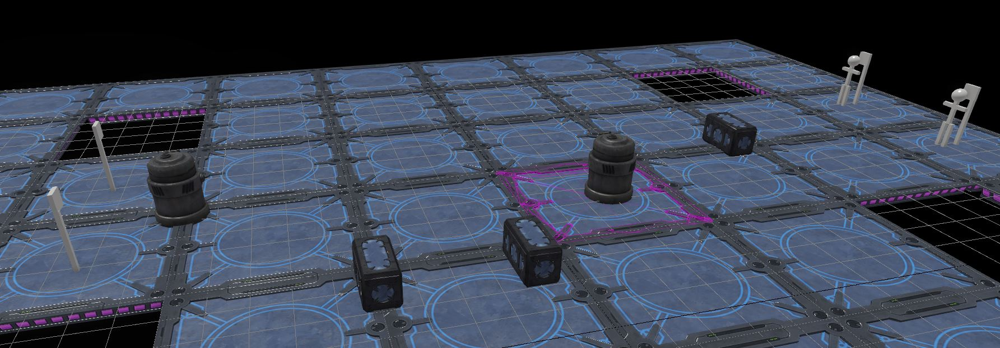
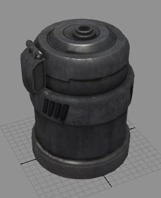

# Set up levels to use Gameware Navigation

This document describes how to set up your levels to use Gameware Navigation in Stingray Editor. You will learn how to add and configure:

* Navigation Worlds
* Navigation Bots
* NavGraphs
* Runtime NavTags
* SmartObjects

For this we provide a set of Units, which you can find in *core/gwnav/units*.

# The NavWorld Unit

Add an instance of the `navworld` Unit in your level in order to configure the NavWorld.

In Lua, the `NavWorld` object will look for a unit instance containing a `GwNavWorld` script data object, and automatically initialize itself from the parameters stored in this object.

The `navworld` Unit configures:

*	The maximum time per frame (in seconds) spent computing paths. Default is 0.001. (float scriptdata `pathfinder_budget`). If a path computation could not be completed during one frame with this budget, the path computation will continue over the next frames (time slicing).
*	The maximum time per frame (in seconds) spent computing the dynamic NavMesh. Default is 0.001. (float scriptdata `dynamicnavmesh_budget`).
*	The rendering of Navdata. The Boolean scriptdata `render_navdata` allow to render or not the navdata at runtime by default.

# BotConfiguration

This Unit lets you configure:

*	Path finder configuration
	Avoidance configuration: Set the `GwNavBotConfiguration/avoidance/enable` scriptdata to `false` to disable avoidance.
*	Trajectory mode: Set the `GwNavBotConfiguration/use_channel` scriptdata to `true` to use a spline trajectory for smoother movements but heavier computation time.
*	The shortcut trajectory configuration
*	The channel trajectory configuration

In Lua, the `NavWorld` object looks for unit instances containing a `GwNavBot` script data object, and automatically creates a bot using `GwnavBot/configuration_name` to retrieve the BotConfiguration to use for setting up the bot.

## Allowed, forbidden and custom cost of navmesh layers

The bot will be allowed to go through all navtags at a cost multiplier of 1.
Except for those specified into `navtag_layers` scriptdata array made of objects with 2 entries `layer_id` and `layer_cost_multiplier`.

`layer_id` refers to the `layer_id` component of a navtag. This may be set at generation time (see "Tagging the NavMesh at generation time" under ~{ Generate navigation mesh }~) or at runtime (see [NavMesh tagging script data] below).

`layer_cost_multiplier` gives the cost applied when traversing such layer, negative or null costs forbid the layer to be traversed.

For instance in the following example a navtag with `layer_id` 1 will c cost the traverrsed distance multiplied by 1 since it is not present. A navtag with `layer_id` 0 will cost twice the cost of `layer_id` 1. And A navtag with `layer_id` 2 cannot be traversed at all.

    navtag_layers = [
      {
        layer_id = 0,
        layer_cost_multiplier = 2
      },
      {
        layer_id = 2,
        layer_cost_multiplier = -1
      },
    }

		> **Note:** Allowed, forbidden, or custom costs can be changed at runtime with Lua functions. Navgraph can also contain a layer_id.

# NavGraph

A Navgraph lets you connect portions of the NavMesh together.
You'll typically use this to join two ledges for things like ladders, jumps, climbing, elevators, and so on.

To place a NavGraph in the editor you can use the `navgraphconnector` Unit (the **Graph Connector** unit in the ~{ Create panel }~ or the Create menu). Place the unit, then translate, rotate and scale it.
At runtime, this unit automatically generates a set of NavGraph to join the two ledges.

`GwNavGraphConnector/sampling_step` changes the navgraph density along the ledges.

The following script data setup the tagging :

*	Integer script data `layer_id`
*	Integer script data `smartobject_id`
*	Integer script data `user_data_id`

# Dynamic TagVolume

Dynamic TagVolumes allow to dynamically tag the NavMesh at runtime.
A typical example is to tag the NavMesh while fire and smoke are propagating; in the tag, the navmesh layer can allow firemen to navigate in smoke while other bots can not.
Another application is to tag the NavMesh with a smartobject to jump over fences that can be moved at runtime.

Dynamic TagVolumes can be added through:

*	lua scripting
*	Unit script data

## Lua scripting TagVolumes

See `GwNavTagVolume` in the API documentation.

## NavMesh tagging script data

The following script data setup the tagging (similarly to what is put in a `GwNavGenTag`, see "Tagging the NavMesh at generation time" under ~{ Generate navigation mesh }~):

*	Boolean script data `is_exclusive` : when set to `true` allows to make the tagbox exclusive and consequently cut the navmesh.
*	Integer script data `layer_id` : identifies the layer_id this navtag belongs to, allowing to control how bots traverse it.
*	Integer script data `smartobject_id` : identifies the smartobject associated to this navtag to control the bot state and cost at runtime, and customize how the smartobject will be traversed by bots.
*	Integer script data `user_data_id` : a custom value for users
*	Object script data `color` with integers script data `r`, `g`, `b` :  a custom color to ease visual debug with the NAvigationLab.

## Specifying the TagVolume for a Unit

Add a box tagvolume to a Unit, adding a scriptdata object `GwNavTagBox`.
The following children script data control the height, width and depth of the box:

*	`GwNavTagBox/half_extent/x`
*	`GwNavTagBox/half_extent/y`
*	`GwNavTagBox/half_extent/z`

place its local center:
*	`GwNavTagBox/offset/x`
*	`GwNavTagBox/offset/y`
*	`GwNavTagBox/offset/z`

and finally specifies the tagging by adding children script data to `GwNavTagBox` as described under [NavMesh tagging script data] above.

# Dynamic Obstacles

Obstacles are navigation objects which can be either taken into consideration by the avoidance system (for example when moving) or projected into the NavMesh as a tagvolume (when not moving).

## Box obstacle

Add a box obstacle to a Unit, adding a scriptdata object `GwNavBoxObstacle`.

Height, width, depth and local center of the box can be set similarly to a TagVolume, see [Specifying the TagVolume for a Unit]. But it has two other parameters:

Set `GwNavBoxObstacle/rotation_mode` to `free` if the obstacle can freely rotate around any axis. like for example a physics obstacle. Set it to `yaw` (default) for obstacles mostly rotating around yaw like vehicles.

To make the obstacle trigger a tagvolume set the scriptdata `GwNavBoxObstacle/does_trigger_tag_volume` to true. If set to false, the obstacle will be taken into account only by the avoidance system. This can then be changed with `NavBoxObstacle:set_does_trigger_tagvolume` lua function.

Finally, specifiy the tagging by adding children script data to `GwNavBoxObstacle` as described under [NavMesh tagging script data] above.

## Cylinder obstacle

Add a cylinder obstacle to a Unit, adding a scriptdata object `GwNavCylinderObstacle`.

The following children script data control the height and radius of the cylinder (the Unit root position is the base of the cylinder):

*	`GwNavCylinderObstacle/height`
*	`GwNavCylinderObstacle/radius`

To make the obstacle trigger a tagvolume set the scriptdata `GwNavCylinderObstacle/does_trigger_tag_volume` to `true`. If set to `false`, the obstacle will be taken into account only by the avoidance system.

Finally, specifiy the tagging by adding children script data to `GwNavBoxObstacle` as described under [NavMesh tagging script data] above.
