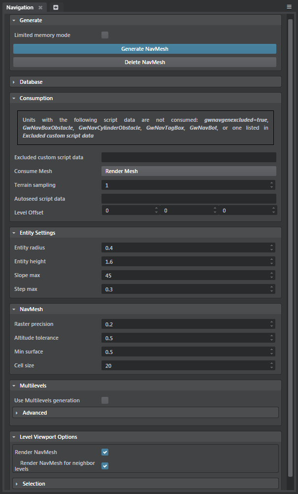
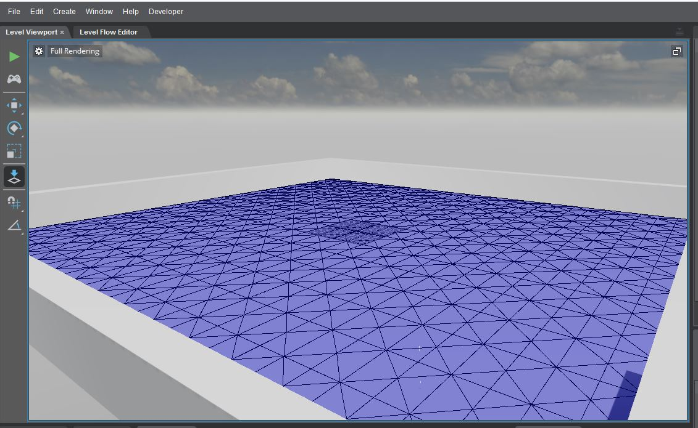
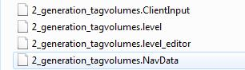
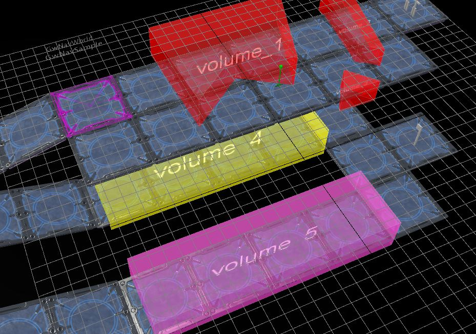
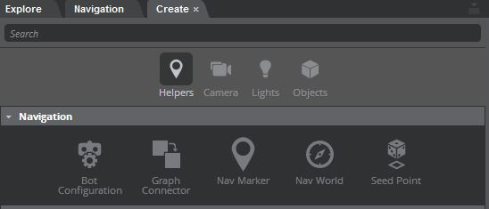
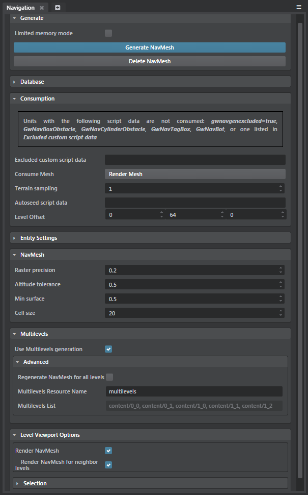

# Generate navigation mesh

This topic describes how to generate navigation mesh in the Stingray engine. You will learn how to consume level geometry and tag the navigation mesh.

## Generation input geometry

The Navigation mesh can be automatically generated from:

* Units
* Actors
* Terrains
* Prototypes

## To generate a NavMesh in the Level Editor

1. To open the generation window, select **Window > Navigation** from the main menu bar.

  	

2. Configure input in the  ~{ Navigation options }~.

  	Refer also to the complete Gameware Navigation documentation for details.

3. Click **Generate NavMesh** in the ~{ Navigation options }~ to generate NavData.

  	Once generated, the NavMesh is rendered on top of the consumed Level geometry.

  	> **Tip:** If you don't want the NavMesh rendered, turn off the Render NavMesh in the **Navigation Options** window.

  	

  	Generated NavData is saved beside the .level file with the same base filename and a .navdata extension.

  	

To delete the generated NavData, you can click **Delete NavMesh** in the **Navigation Options** window.

## Tagging the NavMesh at generation time

Tagging the NavMesh lets you:

*	Define areas or layers where bots are allowed or not allowed to walk, see "Allowed, forbidden and custom cost of navmesh layers" under ~{ Set up levels to use Gameware Navigation }~.
*	Associate a smartobject to a given area (such as a door step or breakable bridge) to control the state and cost of this area.
*	Associate a custom ID to triangles for spatial reasoning or custom path following.

The NavMesh can be tagged at generation time either on a per-unit base or using the level editor's volumes with provided volume types.

### Per Unit tagging

To tag a Unit add a script data object `GwNavGenTag` with the following children:

*	Boolean script data `is_exclusive` : if set to true the navtag punches a hole in the NavMesh
*	Integer script data `layer_id`
*	Integer script data `smartobject_id`
*	Integer script data `user_data_id`
*	Object script data `color` with integers script data `r`, `g`, `b`

### Generation tagvolumes



The gwnav volume types are located in *core/gwnav/volumes*.

*	Choose a `gwnavexclusivetagvolume` volume type to remove at generation time NavData inside a volume.
*	Choose a `gwnavtagvolume_layerXXX` volume type to tag the NavMesh with layer XXX.
*	Choose a `gwnavtagvolume_smartobjectXXX` volume type to associate the smartobject XXX to the intersecting NavMesh.

## Seedpoints

Spawn seedpoint Unit instances to only keep NavData connected to these seedpoints.
This allows to prevent having NavData on tree tops, barriers or roof tops.

Also note that NavMarker unit can also be used as `gwnavseedpoint` script data since this unit is instanciated to mark places to go during the game, hence if a NavMesh is generated there it should be kept. Though `gwnavseedpoint` is unchecked by default for NavMarkers.

Seedpoints are accessible using the ~{ Create panel }~:



## Multilevels Generation

Multilevels Generation is useful if you have several levels loaded at the same time at runtime and you want your Bots to be able to move seamlessly from one level to another level. Each level needs a NavMesh generated at its runtime location, and each level must be generated with the same settings.

To set up, enable, and generate multilevel NavMeshes:

1. Create a valid sjson file called `multilevels.gwnavgen_firstinit` containing one sjson object named `initial_levels_offset_list`, which contains sjson objects for each settings (currently only default is used). Each object contains names representing the resource name of the level to use, and arrays of 3 numbers representing its offset. For example:

	``` javascript

      initial_levels_offset_list = {
        default = {
          level_resource_name_1 = [0,0,0]
          level_resource_name_2 = [10,0,0]
        }
      }

    ```
2. In the Navigation options (**Window > Navigation**), enable **Use Multilevels generation**.

  	Each level generated when **Use Multilevels generation** is on has its settings shared and synced in a `multilevels.gwnavgen_settings` file.
3. (Optional) In the **Multilevels Resource Name** field, enter a custom resource name.
4. Set the **Level Offset** values to match the placement of the level at runtime in order to have the NavMesh generated at the proper position.

  	**Note:** All the levels involved in the multilevels generation display in the **Multilevels List**.

    

The first time you specify the list of levels and their offset values in `multilevels.gwnavgen_firstinit` and click **Generate NavMesh** from the first level, Stingray generates the settings for all the levels. These settings are then used when you generate NavMeshes for all those levels, with no further set up required.

>**Tip:** In order to iteratively generate Multilevel NavMeshes, **it’s a good idea to back up** `.GenIO`, and `.ClientInput` files in the `project_gwnav` folder to your source control (in addition to the `project` folder).
