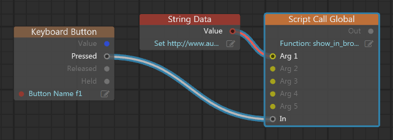
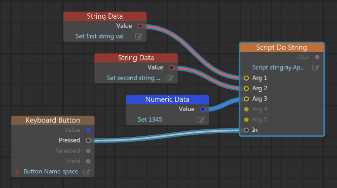
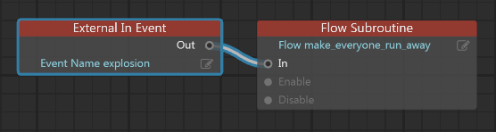

# Communicating between Flow and Lua

Flow and Lua may seem like very distinct and separate systems, because the workflows you use to author gameplay are quite different. However, they are not mutually exclusive. They coexist peacefully in their own parallel evaluation contexts.

This page describes some strategies that you can use to communicate data and trigger events between the two systems.

## Using custom Flow nodes

You can define custom Flow nodes for your project that call out to functions that you define in your Lua code. This is a powerful and flexible way to tie the two systems together:

-	You can easily make custom Lua code react immediately to triggers in the game at any time.
-	Your Lua function can accept any number of input values from Flow, which are exposed as connection slots in the custom node.
-	Your Lua function can return values to the Flow graph, which are also exposed as output slots in your custom node. You can hook up these output values to other Flow nodes in order to use the information computed by the Lua function immediately.

For details on setting this up, see ~{ Create custom Flow nodes in Lua }~.

## Calling global Lua functions from Flow

You can call any global Lua function from Flow without having to create a custom node, by using the **Script > Script Call Global** node. You can pass up to five arguments to the Lua function by hooking up data connectors to the input slots on the node.

The downside of this approach relative to using a custom node is that you cannot retrieve any return values directly from the Lua function that you call. You can trigger Lua computations, but you cannot use the results directly.

See the node description for additional details.

## Typing Lua code directly within Flow

Instead of calling out to a function that is defined in a Lua script, you can enter a block of Lua script directly into the Script slot of the **Script > Script Do String** node. When the node's In event is triggered, your code block is evaluated within the game's Lua environment.

As above, you can pass up to five arguments to your code block. As above, your Lua code cannot directly return any events to your Flow graph.

See the node description for additional details.

## Exchanging data through "External" inputs and outputs

Your Flow graphs and Lua scripts can set and read data values in a set of shared "external" variables. The level flow for each level and the unit flow for each unit maintain a separate set of these external variables.

### Setting and retrieving external inputs and outputs in Lua

-	To set an external variable in a level flow graph or unit flow graph, call `stingray.Level.set_flow_variable()` or `stingray.Unit.set_flow_variable()`.
-	To read an external variable that has been set in a level flow or unit flow, call `stingray.Level.flow_variable()` or `stingray.Unit.flow_variable()`.

### Setting and retrieving external inputs and outputs in Flow

-	To set an external variable in a level flow or unit flow, use the nodes in the **External > Output** category. For example, use **External > Output > External Output Boolean** to set a true or false value.
-	To read an external variable that has been set by a Lua script, use the nodes in the **External > Input** category. For example, use **External > Input > External Input Boolean** to get a true or false value.

Note that these "external" variables are not the same as the variables that you can get and set using the nodes in the **Variable** category. <!-- TODO: see also link to the flow variables topic -->

## Triggering a Flow event from Lua

Your Lua code can fire events to your level flow or unit flow graphs at any time.

-	To fire a level flow event from Lua, call `stingray.Level.trigger_event()`. Pass the level object and the name of the event.
-	To fire a unit flow event for a particular unit, call `stingray.Unit.flow_event()`. Pass the unit object and the name of the event.
-	To respond to the event in flow, use the **External > External In Event** node and set the Event Name value to the same name you used in the Lua call.

For example, if you run the following Lua code:

~~~{lua}
stingray.Level.trigger_event(myLevel, "explosion")
~~~

You can respond to it in your level flow as follows:

>	**Note:** You can also use the `Level.trigger_level_loaded()`, `Level.trigger_level_update()` and `Level.trigger_level_shutdown()` functions to trigger those events in your level flow. However, if you are using the Appkit to manage your project's levels, it will automatically call these triggers for you.
