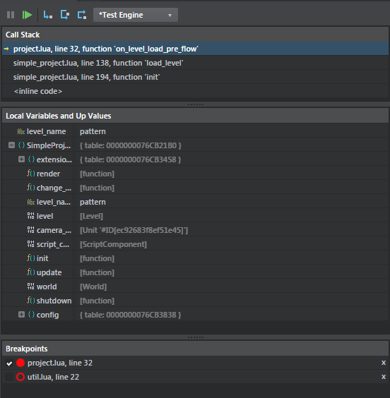

# Using the Script Debugger

- **Window > Script Debugger**

The **Script Debugger** gives you controls and information for debugging Lua code that is running in an attached instance of the Stingray engine.

**Notes:**

- The **Script Editor** also includes debugging controls and feedback while the game is broken. See ~{ Using the Script Editor }~.
- The ~{ Status bar }~ and ~{ Log Console }~ also display notification messages when you pause or resume Lua execution.

## Toolbar

<dl>

<dt>Break</dt>
<dd>Stops execution at the next executed line of Lua. Only enabled while testing a level or running the project from the Stingray Editor.</dd>

<dt>Play/Continue</dt>
<dd>If you are not currently testing a level or running your project, this is equivalent to choosing **Edit > Level Testing > Test Level** from the main menu. If you are testing a level or running your project and the execution has been broken, this continues execution until the next breakpoint is hit or you break execution manually.</dd>

<dt>Step In</dt>
<dd>Step to the next line of Lua code, descending into called functions and nested code blocks. **Hotkey: F11**</dd>

<dt>Step Over</dt>
<dd>Step to the next line of Lua code within the same file, stepping over function calls and nested code blocks. **Hotkey: F10**</dd>

<dt>Step Out</dt>
<dd>Step to the next line of Lua code outside of the current function. **Hotkey: Shift+F11**

  > **Note:** Step behaviors are only available when the Lua execution is broken.

</dd>

<dt>Currently controlled engines</dt>
<dd>This drop-down box displays the currently controlled engines when you start testing. If you have multiple instances of your game running on different platforms, you can use this drop-down list to specify which instances the debugging controls should apply to.

  > **Note:** The Editor engine is available to debug only in the Development configuration mode.

</dd>
</dl>

## Call Stack

Displays the Lua call stack. As you step through your code and descend into function calls, the call stack will add the functions in order to help you trace the execution flow.

An arrow indicates the currently selected stack frame.

- To open an entry's location in the **Script Editor** without changing the current frame stack, click that entry in the list.
- To change the current frame stack, double-click the entry instead.

## Local Variables and Up Values

Displays the current set of Lua local variables and up values for the current stack frame. (In Lua, "up values" are local variables that are not defined within the current function, but that are available within the function because they form part of its *closure*. See [this page](http://www.lua.org/pil/6.1.html) from the book *Programming in Lua*.)

The type of each variable is represented by an icon before the variable name. Hover over the type icon for details.

- To expand and collapse table values, click the **+** and **-** buttons.

### Modifying local variables

You can modify local variables and continue the game using the new values.

-	To modify simple values (strings and numbers), click the value.
-	To commit modified values, press Return or click OK next to the text input.
-	To discard changes, press Esc or click outside the text editor.

## Breakpoints

Displays the list of current breakpoints.

Enabled breakpoints are displayed as solid circles. Disabled breakpoints are displayed as outlined circles.

-	To delete a breakpoint, click its **x** button on the right side of the list.
-	To display the breakpoint file location in the **Script Editor**, double-click an entry in the list.
-	To enable or disable a breakpoint, check or uncheck its check box on the left side of the list.
