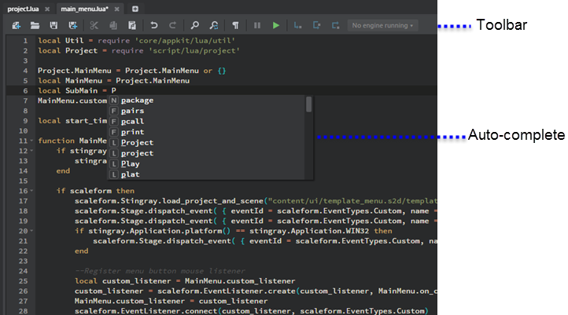
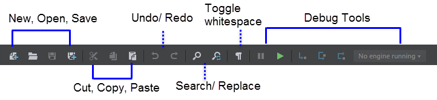

# Using the Script Editor

- **Window > Script Editor**

The **Script Editor** helps you create and edit Lua scripts for your game in the Stingray Editor.

> **Tip:** You can also open and edit other kinds of text files in the **Script Editor**, including *.ini* files, *.package* files, and other kinds of Stingray data resources that use the SJSON format.

## Script Editor toolbar

## Writing code in the editor

| Task overview |
| ------------- | ------------- |
| **To open an existing script**  | Click the **Open** icon , then browse to select a .lua script file.|
| **To save a script**  | Click the **Save As** icon  to save the script with a new name. Use this when you've opened an existing script to use as a template, but don't want to overwrite the original. You can also click the Save icon  in each document tab to save as you work.|
| **To create a new, blank script**  | Click the **New** icon . The **Script Editor** clears the current script and replaces it with a blank script.  |
| **To view context-sensitive help ** | Hover over elements in the script. To get detailed help on an object or function from the Stingray Lua API, right-click and select **API Documentation**.|
| **For all basic operations  ** | You'll find that standard hotkeys apply in the **Script Editor** for most basic operational tasks such as undo/redo, cut, copy, paste, select all, find on the page, and so on. (Ctrl+C and Ctrl+V to copy and paste, for example). You can also right click to select some of these options from a pop-up menu.|

### Auto-completion

The **Script Editor** integrates both Lua documentation and Lua command auto-completion so that as you type, dynamic tooltips display reference information, as well as auto-complete suggestions.

|  Auto-complete hotkeys    |
|-----------------------------|-----------------|
| Manually pop up suggestions | Ctrl + Spacebar |
| Close                       | Esc             |
| Accept suggestion           | Tab  or Enter   |

> **Tip:** To send single line Lua scripts or predefined commands to a running game, you can use the ~{ Status bar }~.

## Debugging tools

This part of the toolbar contains the same debugging tools as the **Script Debugger**. For details, see ~{ Using the Script Debugger }~.

-	The **Script Editor** shows breakpoints as red circles to the left of the line numbers.
-	When a breakpoint is hit and code execution is paused, the location of the top of the call stack is displayed as a yellow highlighted area in the gutter.
-	While broken, you can get the values of current local variables by hovering the mouse cursor over the variable name.
- When debugging, you can test a selected piece of Lua code by right-clicking the selected text and selecting **Evaluate in Engine**.

| Task overview |
| ------------- | ------------- |
| **To set or unset a breakpoint**  | Left-click the gutter to the left of the line number, or use **F9** to toggle a breakpoint on the current line.|
| **To enable or disable a breakpoint**  | Right-click the breakpoint circle.|

---
Related topics:
-	~{ Debugging Lua }~
-	~{ Using the Script Debugger }~
---
