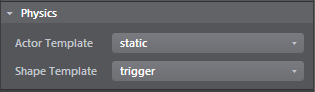
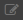
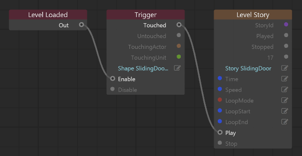

# Example workflow: Trigger a door opening

Triggers are simple game objects that let you trigger events when other objects come in contact with them. This workflow explains how to animate a door opening when the player gets close to it.

>  You can also find a video tutorial that demonstrates this workflow [here](http://area.autodesk.com/learning/trigger-a-door-opening).

##Step 1. Set up the door

1. Place the door unit in your level.

	See ~{ Place objects in a level }~.

2. Create a story to animate the door object in the level.

	See ~{ Create simple animations with the Story Editor }~.

Next, you'll create the trigger that will start this animation.

##Step 2. Create the trigger

1. ~{ Create a trigger }~ volume in front of the door you want to animate.
2. In the ~{ Property Editor }~, verify that the trigger has the following properties set in the **Physics** section:

	-	**Actor Template**: **Static**
	-	**Shape Template**: **Trigger**

 (See also ~{ Trigger properties }~.)

##Step 3. Set up the trigger effect with Flow

1. Switch to the ~{ Level Flow Editor }~.

2. Right-click in the graph view area to start adding nodes. Select the following from the pop-up menu to add `Level Loaded`, `Trigger`, and `Story Event` nodes:

	-	**Event > Level Loaded**
	-	**Event > Trigger**
	-	**Level > Level Story**

3. On the **Event > Trigger** node, click  next to **Shape**, then select your trigger.

4. On the **Level > Level Story** node, click  next to **Story**, then select the story animation you created.

5. Connect **Event > Level Loaded** **Out** to **Event > Trigger** **Enable**, then connect **Event > Trigger** **Touched** to **Level > Level Story** **Play**.

	Your flow graph should look similar to the following:

	

3. In the **Asset Browser**, double-click the door unit to open the **Unit Editor**, and confirm that the **Actor Template** property is set to **keyframed**.

##Step 4. Test the effect

1. Click Play in the ~{ Toolbar }~ to play the level, and walk to the door.
	The door should animate when you reach the trigger area.

	(See also ~{ Ways to run your project }~.)

---
Related topics:
-	~{ Story Editor }~
-	~{ Visual programming using Flow }~
-	~{ Trigger properties }~
---
