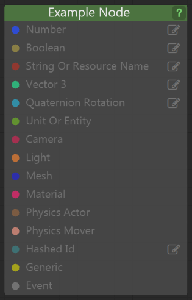

# Flow Node Colors (Level Flow)

A flow node expects certain types of data for both input and output.  The type of data is signified by its color on the inputs and outputs.  Many nodes have several inputs and outputs of varying data types.  The color is helpful to know what is expected and what is returned from each node (function).

Green: Unit Data

Blue: Numeric Data

Grey: Event Data

Light Brown: Boolean (True/False) Data

Dark Brown: String Data

BlueGreen: ID Data

Teal: Vector 3 Data

