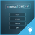

# Creating User Interfaces

To create user interface elements in Stingray, you'll use the Scaleform Studio Editor.

Topics in this section explain the basics of integrating a Scaleform Studio UI into your game in Stingray.

For complete information about working in the Scaleform Studio Editor, visit the <a href="http://www.autodesk.com/scaleformstudio-help" target="blank">Scaleform Studio Help</a>. This online help system is also available from the Help menu in the Scaleform Studio editor.

<table class="not-ruled"><tr><td>

</td><td>
Check out the Advanced Menu project to see a snazzier example of what Scaleform Studio can do for you. Open it from the **Online Projects** tab of the **Project Manager**, or [download the project here](https://gamedev.autodesk.com/stingray/plugins/advanced_menu_example)!
</td></tr></table>
