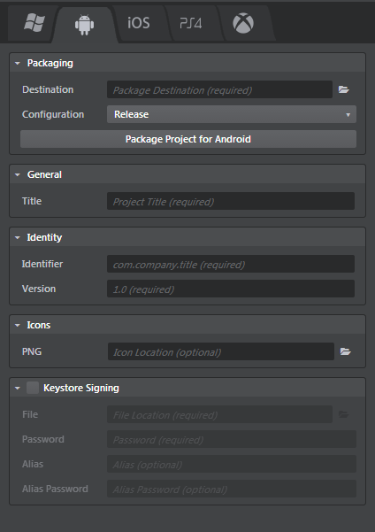

# Packaging a game for Android

To package a project for Android:

1.	If you haven't done so already, set up the ~{ Requirements for Android game development }~ on your Windows computer.
2.	In the Stingray Engine, open the **Deployer** panel to the Android tab and enter the required information. (See below.)
3.	Click **Package Project for Android**.

Stingray creates an *.apk* file for your game, and copies it to the location on your computer that you specify in the **Destination** field.

After deploying from Stingray:

-	To copy your deployed game to a connected device for testing, use the `adb` utility. You can find this tool in your Android SDK installation folder, under the `/platform-tools/` sub-directory. Connect your device, open a command prompt, and type:

	`adb install <path-to-apk>`

-	To distribute your game on the Google Play store, use the tools provided by Google. See the [Developer Console Help](https://support.google.com/googleplay/android-developer/answer/113469?hl=en) for more information on the Google Play Developer Console.

## Android deployment settings

You can set the following options in the **Deployer** panel for Android devices.

### Packaging settings

These settings are common for all tabs. See ~{ Using the Deployer panel }~.

### General settings

<dl>
<dt>Title</dt>
<dd>The title of your project. This sets the name of the executable file for the application, and the product name for online stores.</dd>
</dl>

### Identity settings

<dl>
<dt>Identifier</dt>
<dd>The unique process name of your application. It contains two parts separated by a dot.</dd>

<dt>Version</dt>
<dd>The application version, in two-part notation.</dd>

<dt>Android flavor</dt>
<dd>Select from either the regular, Gear VR, or Google VR enabled Android engine.</dd>
</dl>

### Icons settings

Browse to select your game icon in PNG format. It can be any size, but we recommend a maximum of 512x512 pixels.

### Keystore Signing settings

Keystore signing is required in order to test the generated *.apk* file on a device or publish it on the store. If you do not enable the **Keystore Signing** section, the editor automatically uses the `debug.keystore` that is installed at the same time as the Android SDK at `%USERPROFILE%/.android/debug.keystore`.

<dl>
<dt>File</dt>
<dd>The location of the custom keystore file.</dd>

<dt>Password</dt>
<dd>The keystore password.</dd>

<dt>Alias</dt>
<dd>Provide the keystore alias if required.</dd>

<dt>Alias Password</dt>
<dd>The alias password if required.</dd>

</dd>
</dl>

For more information on keystore signing, see the [Android documentation](http://developer.android.com/tools/publishing/app-signing.html).
