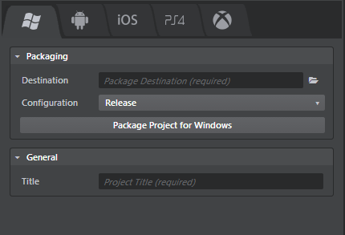

# Package the project for Windows

To package a project for Windows:

1.	In the Stingray Editor, open the **Deployer** panel to the Windows tab and enter the required information. (See below.)
2.	Click **Package Project for Windows**.

Stingray creates an executable file for your game, named according to the title you set in the **Title** field. It copies this *.exe* file, along with all required *.dll* files and bundled data, to the location on your computer that you specify in the **Destination** field.

You can test or distribute your game by simply copying or zipping up this folder, or by packaging the folder contents into an installer.

## Additional runtime requirements

To run on Windows, the Stingray engine requires the **DirectX End-User Runtimes** from Microsoft.

If you create an installer for your game, you need to package these redistributable libraries into your installer. If you don't, your customer will have to download and install the runtimes if they don't already have them installed.

You or your customers can download the required libraries from this link: <https://www.microsoft.com/en-us/download/details.aspx?id=8109>

## Windows deployment settings

You can set the following options in the **Deployer** panel for Windows devices.

### Packaging settings

These settings are common for all tabs. See ~{ Using the Deployer panel }~.

### General settings
<dl>
<dt>Title</dt>
<dd>The title of your project. This sets the name of the executable file for the application.</dd>
</dl>
