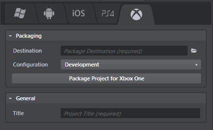

# Packaging a game for Xbox One

To package a project for Xbox One:

1.	If you haven't done so already, follow the first-time setup instructions under ~{ Get started on Xbox One }~.
2.	In the Stingray Editor, open the **Deployer** panel to the Xbox tab and enter the required information. (See below.)
3.	Click **Package Project for Xbox One**.

Stingray copies the files your game needs to the location on your computer that you specify in the **Destination** field.

After deploying from Stingray, you can use the development tools provided by Microsoft to copy your game to an Xbox One device for testing, and to finish preparing your game for distribution using any of the channels supported by Microsoft.

## Xbox One deployment settings

You can set the following options in the **Deployer** panel for Xbox One devices.

### Packaging settings

These settings are common for all tabs. See ~{ Using the Deployer panel }~.

### General settings
<dl>
<dt>Title</dt>

<dd>The title of your project. This sets the name of the executable file for the application, and the product name for online stores.</dd>
</dl>
