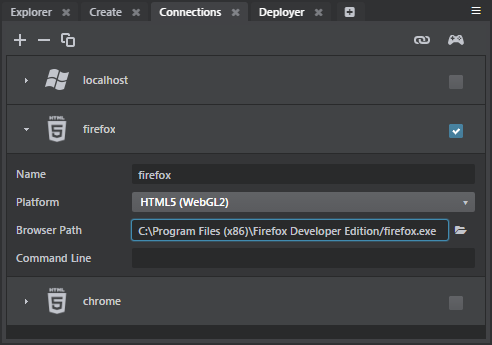
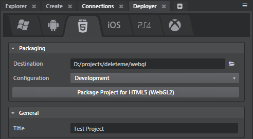
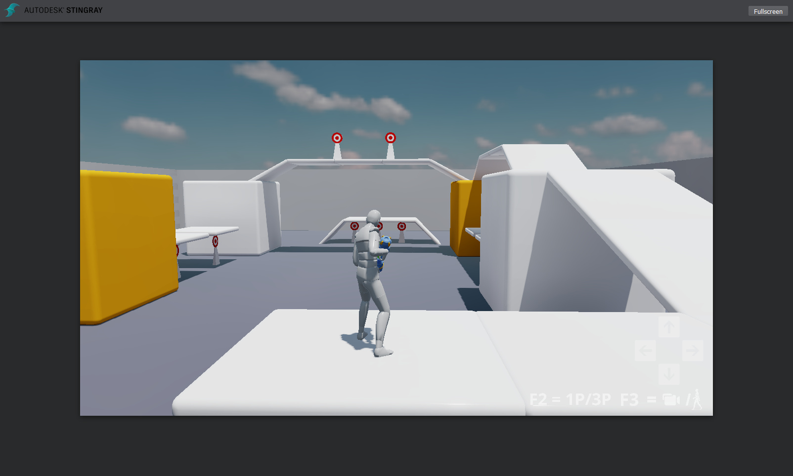

# Run your project in a browser using WebGL

If you've been waiting impatiently to see your Stingray projects up and running in a web browser, this experimental feature offers you a first glimpse of the possibilities.

In this release, you can:

-	Launch your project in a browser straight from the Stingray editor.
-	Deploy your project to disk. This lets you launch the project in a browser later on, or host it on a web server so that others can launch it remotely.

You can't yet:

-	Mirror the Stingray editor viewport to the browser.
-	Run the Stingray editor or any of its tools in the browser to edit your levels and projects.

In addition, you may notice that not all of the rendering settings offered by the shading environment are available yet when the project is running in the browser. We're still working on making more of these high-quality effects work under WebGL.

## Get started

1.	Install and set up a supported browser.

	Stingray requires WebGL 2.0 (including OpenGL ES 3.0 and GLSL 3.00), which is currently supported by Google Chrome (Version 52) and Mozilla Firefox.

	Follow the instructions under ~{ Use Google Chrome to run your project }~ or ~{ Use Mozilla Firefox to run your project }~.

1.	If you're using Chrome, launch it now from the shortcut you created. The Stingray editor will open your project in a new tab if the browser is already open, but can't start it up with the required command-line parameter.

1.	Start the Stingray editor, and enable its experimental features. See ~{ About Experimental Features }~.

	If you have the **Connections** or **Deployer** panels open already, you'll have to close and re-open them (or restart the Stingray editor) so that the new setting can take effect.

1.	To launch your project in a browser from the Stingray editor, open the **Connections** panel and set up a new HTML5 (WebGL) target for each browser you want to target.

	-	Set a name to identify the connection.
	-	Set the **Platform** option to **HTML5 (WebGL2)**.
	-	Set the **Browser Path** to point to the *.exe* file for your installation of Firefox or Chrome. If you have multiple versions of these browsers installed, make sure that this setting points to the version that you have already set up to use WebGL 2.0.
	-	Leave the **Command Line** blank. For WebGL connections, this defines extra parameters that are sent to the launched HTML page in the URL search string. It's not used for anything at the moment, but might be useful if you want to customize the HTML wrapper page (see the next section).

	

	See also ~{ Using the Connections panel }~.

1.	To deploy the project to disk, open the **Deployer** panel to the **HTML5** tab. Set up the requested fields, and click **Package Project for HTML5 (WebGL2)**.

	

	See also ~{ Using the Deployer panel }~.

When you get the project successfully running in the browser, it looks something like this:

## About the HTML5 (WebGL2) project output

When you launch or deploy to the HTML5 (WebGL2) target, Stingray compiles your project's assets the same way it does for any other platform. It writes all the compiled resources to the `webgl` folder under your project `_data` folder. However, for WebGL targets, these individual data files are just an intermediate stage in the process.

The compilation process also creates an additional `webgl_packaged` folder in the same location, where it drops your project in its final runnable form. This folder contains:

-	A `package.data` file that bundles up all of your project assets into a single binary file.

-	A set of *.js* files that are essentially the result of compiling the game engine's runtime code into JavaScript.

-	An *.html* wrapper that loads the engine JavaScript and instructs it to launch your project. This default page is branded with Stingray logos, but you can customize it freely if you want, or use it as a model to write your own HTML wrapper page.

Deploying the project to the HTML5 (WebGL2) target copies this `webgl_packaged` directory to the final location you set in the **Deployer** panel.

To launch your project from disk, open the *.html* wrapper file in any supported browser. To launch your project over an Internet connection, host these files on a web server and direct your browser to open the wrapper *.html* file at its URL on your web server.

## About the launch process

Starting up a Stingray project in the browser is a multi-step process. This sequence happens automatically without you needing to do anything, but it can be helpful to know a bit about what's happening behind the scenes.

1.	**Downloading**. In this step, your browser loads into memory all of the engine JavaScript and the compiled data that makes up your project.

	If you're running from a copy of the project on disk, like when you launch from the **Connections** panel, this step will probably be virtually instantaneous. However, if you're connected remotely to a project hosted on a web server, this may take some time, depending on the size of your project.

1.	**Preparing**. This compiles the downloaded JavaScript code.

	The first time you run a project in the browser, this step can take some time to complete. Subsequent launches usually go faster.

	You may find that this step takes longer when shared memory is enabled for the browser. This is a tradeoff in order to get smoother performance once the project is actually running.

1.	**Running**. In this step, the page starts running the compiled JavaScript that makes up the engine.

1.	**Loading**. This step starts up your project in the Stingray engine, loading up your resources and finally opening the viewport.

	The time this step takes to complete depends on the amount of content in your project, and what kinds of resources you're loading. For example, materials tend to take a long time to load up, so projects with many materials will have a longer wait here.

	As with the *preparing* step, browser caching typically makes future launches faster.

## Troubleshooting tips

If your project doesn't run in the browser:

-	Double-check that you have followed *all* the steps indicated for your browser under ~{ Use Google Chrome to run your project }~ and ~{ Use Mozilla Firefox to run your project }~, including setting all the required configuration flags.

-	If you have a problem launching from the **Connections** panel, double-check that your **Browser path** points to a supported version of your browser.

-	Press **F12** to open the Firefox or Chrome developer tools.

	The **Console** tab in the developer tools lists any JavaScript errors the browser encountered when trying to open the project. It also lists any messages that your game project writes to the log. This can sometimes be helpful in diagnosing where a problem occurs.

	Here are some of the errors we've heard about, and how to fix them:

	- (Chrome)

		**Error:** “Cross origin requests are only supported for HTTP”

		**Solution:** Make sure you launched Chrome with the --allow-file-access-from-files flag, or start a web server to host the content.

	- (Any browser)

		**Error:** “Invalid typed array range”

		**Solution:** Too much memory was required to even open the page. (We request 1GB up front before running engine.) This happens frequently with 32bit browsers, use a 64bit browser instead.

		**Error:** “Cannot enlarge memory”

		**Solution:** Project is allocating more than the maximum memory permitted (currently 1GB). Reduce your project memory footprint.

-	Let us know about it [on the forum](http://www.autodesk.com/stingray-forums).
