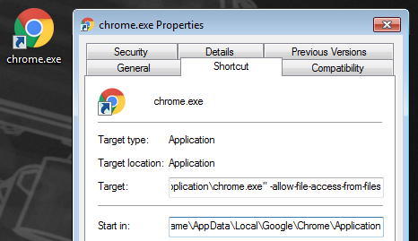
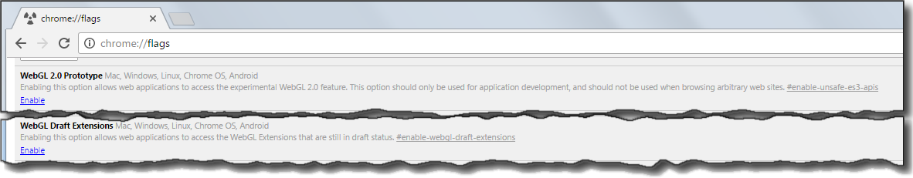
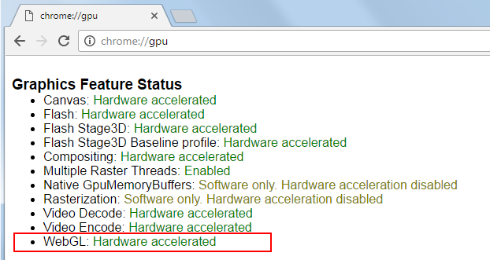

# Use Google Chrome to run your project

This page describes how to set up Chrome to ~{ Run your project in a browser using WebGL }~.

## Step 1. Get a compatible version

WebGL 2.0 is supported as of Chrome **Version 52** or later, for **64-bit** systems.

The official [Chrome stable public release](https://www.google.com/chrome/browser/?platform=win64) is now on Version 52.

## Step 2. Set up Chrome

WebGL 2.0 is disabled by default, so you'll need to enable it in your browser settings.

1.	In order for Chrome to run your project from your local filesystem, you must always start Chrome using the command-line flag `--allow-file-access-from-files`.

	The easiest way to do this is to create a shortcut that points to your `chrome.exe` file, and edit the properties of the shortcut to add in the command-line flag. Right-click your shortcut, choose **Properties** from the contextual menu, go to the **Shortcut** tab, and add `--allow-file-access-from-files` to the **Target** setting.

	

	Always launch Chrome from this shortcut before trying to run your project from your local filesystem, or trying to launch it from the **Connections** panel.

	> **Note:** If you don't want to enable this flag in Chrome, you can also start a web server with your content and point the browser to the served URL.

1.	Open Chrome and enter **chrome://flags** in the location bar.

1.	Find the following settings and click their `Enable` links:

	-	`WebGL 2.0 Prototype`
	-	`WebGL Draft Extensions`

	

1.	Relaunch Chrome, and enter **chrome://gpu** in the location bar. You'll see a list of what features use hardware acceleration to offload rendering calculations to the graphics processor.

	Under **Graphics Feature Status**, make sure that **WebGL** is marked as `Hardware accelerated`.

	

	If it is not, you may be able to change this either:

	-	through your video card driver or configuration utility, or
	-	by enabling the `Override software rendering list` option on the **about:flags** page.
