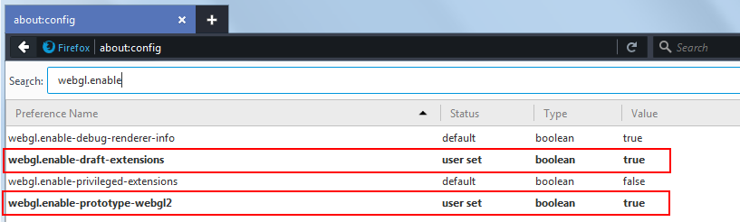

# Use Mozilla Firefox to run your project

This page describes how to set up Firefox to ~{ Run your project in a browser using WebGL }~.

## Step 1. Get a compatible version

WebGL 2.0 is supported as of Firefox **Version 49** or later, for **64-bit** systems.

Download and install either of the following pre-release versions:

-	[Firefox Nightly](https://nightly.mozilla.org/)
-	[Firefox Developer Edition](https://www.mozilla.org/en-US/firefox/channel/#developer)

The [Firefox Beta](https://www.mozilla.org/en-US/firefox/channel/#beta) and official [Firefox public release](https://www.mozilla.org/en-US/firefox/new/) are currently behind version 49, but should be updated over time. This [Release calendar](https://wiki.mozilla.org/RapidRelease/Calendar) gives an indication of the expected timelines for Version 49 to become the latest official release.

For more about the differences between all of these versions, see the [Mozilla wiki](https://wiki.mozilla.org/Release_Management/Release_Process). (Note that what's called *Aurora* on this page is now called the *Developer Edition*.)

## Step 2. Set up Firefox

WebGL 2.0 is disabled by default, so you'll need to enable it in your browser settings.

1.	Open Firefox and enter **about:config** in the location bar. Click **I accept the risk!** to continue past the warning.

1.	Find the following settings and double-click them to change their values to `true`:

	-	`webgl.enable-prototype-webgl2`
	-	`webgl.enable-draft-extensions`

	

2.  Since data is read as a URL, disable the following setting to allow reading from `file://url`:

	`security.fileuri.strict_origin_policy`

3.	We also recommend allowing multiple JavaScript workers to share memory. This can help improve the runtime performance of the project. Find and enable the following setting:

	-	`javascript.options.shared_memory`

	This effectively enables multi-threading in the engine, which is otherwise disabled.
