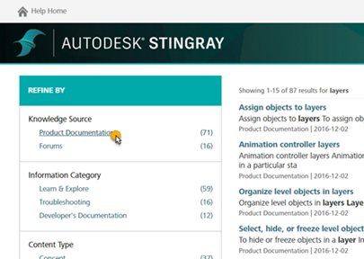
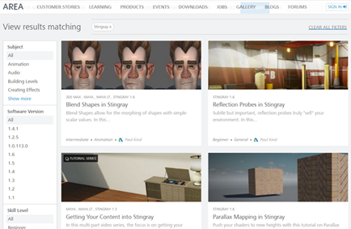
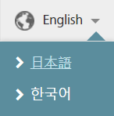
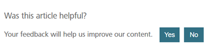

# About the Stingray Help

You're looking at it! Since you already know how to get here, let us point out a few more details.

## Search

By default when you search this site, we'll show you results from multiple sources like YouTube, blogs, our AREA learning site, the Stingray forums, and so on. When you click those search results, sometimes you will navigate away to other sites. As long as you find the answer to your questions, that's great!

On the other hand, if you want to search only within the Stingray Help topics from here, you can narrow your search using the "Refine By" filters in the Search panel. (Try a search now, and you'll see the panel we mean.) If you only want to see topics in the Stingray Help, select the **Product Documentation** filter in the **Knowledge Source** category.

## Tutorials

All of the tutorials we make in-house get posted to [the AREA](http://area.autodesk.com/learning/stingray). We've included a link to that site in the Stingray Help table-of-contents. These tutorials come up by default in your search results and they display within this Help site, but you can also visit and browse the AREA site separately or contribute your own tutorials there. The standalone videos we use in the tutorials are also posted on [our YouTube channel](https://www.youtube.com/user/autodeskgameshowtos).

## Stingray Help in Japanese and Korean

We currently translate the Stingray Help into Korean and Japanese. You can switch to either language using the drop-down menu at the top right corner of this page.

We typically hand off the documentation to be translated as soon as we're ready to ship a new release, and the localized content is available as soon as we can get it, usually about a month after the release date.

## Help us improve

If you notice we've made a mistake, forget to update something, or there's just not enough information, please don't hesitate to tell us about it. We're always working to make this documentation better.

- Use the **Was this article helpful?** widget at the bottom of every page to let us know what you think of that topic. Once you vote, you have the option to send us a note about what's missing or why it was useful. We read them all and make changes to the docs based on these comments all the time.

-	Most pages also have an **Edit this page in GitHub!** button, which takes you straight to our public GitHub source repository. You can rewrite the pages just the way you want them, and send the changes back to us using the GitHub *pull request* mechanism. For more details, see [the main readme.md file](https://github.com/AutodeskGames/stingray-docs/) in the repo.

## Hands-on Training Mission

If reading lots of help topics isn't really your thing and you just want to know the best way to get started with Stingray, we highly recommend our neighbor in the Stingray **Help** menu, the **Hands-on Training Mission**. **Help > Hands-on Training Mission** launches a small set of fast-moving, interactive tutorials designed to get the introductions over with, and get you working in Stingray.

---
Related topics:

- ~{ Get Involved! }~

---
