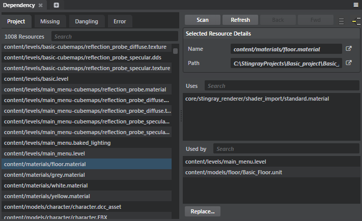

# Dependency tool

- **Window > Dependency**

Use the **Dependency** tool to find which assets are used in a level, which are not used, to check file dependencies, and to easily replace files. 

As you select an asset, the **Dependency** tool lists the assets that use the selected asset and the assets used by the selected asset.   

| To: | |
|------|----|
| View all assets in the project | Click the **Projects** tab. |
| View assets referenced in the project but are missing in the project | Click the **Missings** tab. |
| View existing assets that are not used in the project | Click the **Dangling** tab. |
| Replace an asset | Select an asset, click **Replace** and then select an asset from the dialog window that pops up. Click **Ok** to replace the selected asset. |
