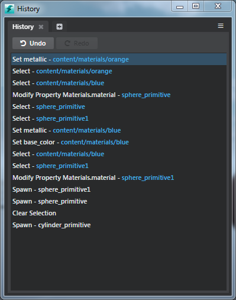

# History tool

*	**Window > History**

The **History** tool lists the set of commands executed in your project and lets you undo/redo the operations.

- View the actions performed along with a link to the asset. The last command executed is highlighted in blue.
- Perform a quick series of undo/redo operations using the **Undo/Redo** buttons.
- Click any command in the list to see the change that occurred.
- For commands with links to an asset or a level, you can click the link to select the asset in the **Asset Browser** or the level instance in the viewport.

  >**Note**: The **History** tool does not list create, rename, move or delete actions in the **Asset Browser**  (operations involving changes to file on disk) and neither can you undo these actions.

For example, you cannot undo these operations:

-	Creating an asset
-	Deleting an asset
-	Renaming assets in the **Asset Browser**
-	Moving an asset or folder in the **Asset Browser**
