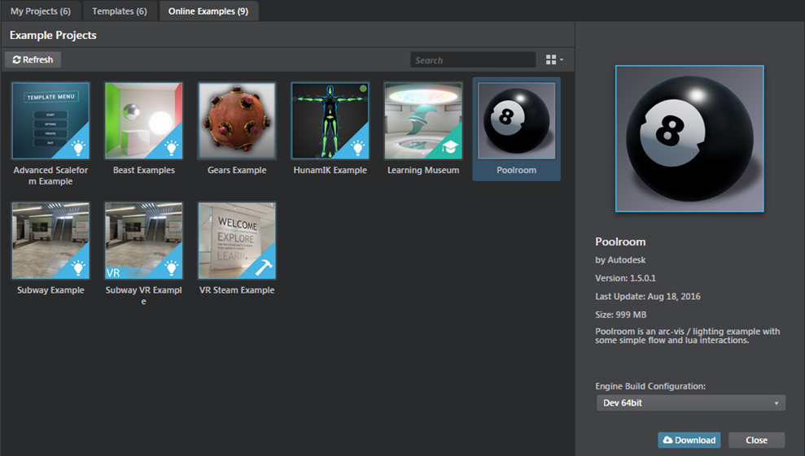
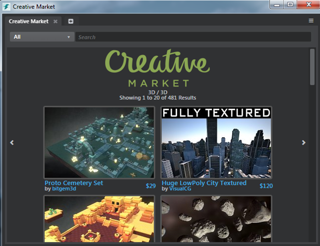

# Download assets and example projects

The template projects available in the ~{ Project Manager }~ provide good starting points for creating your own game projects. However, in order to make them as easy as possible to understand and apply, they are intentionally kept relatively lightweight and simplistic. Therefore they only scratch the surface of what is possible with Stingray.

Sample game projects that illustrate the potential of specific elements of Stingray and example projects that show more complex usage of components like Scaleform Studio, HumanIK, Gameware Navigation and Beast are available as online examples in Stingray. Download these projects using the **Online Examples** tab in the **Project Manager**.

These free sample projects and other [game kits](https://creativemarket.com/apps/stingray/gamekits) that provide real working examples of games built in Stingray are also available in [Creative Market](http://www.autodesk.com/stingray-creativemarket-samples). You can also purchase a variety of 3D assets created by the community for use in your games, or to sell your own creations.

You can access and purchase Creative Market assets for your project using the **Creative Market** panel in Stingray (**Window > Creative Market**).

>Note: Creative Market is not available in Stingray Steam projects.

---
Related topics:
-	~{ Set up a project }~
-	~{ HumanIK sample project and common use cases }~
-	~{ Open an existing project }~
---
