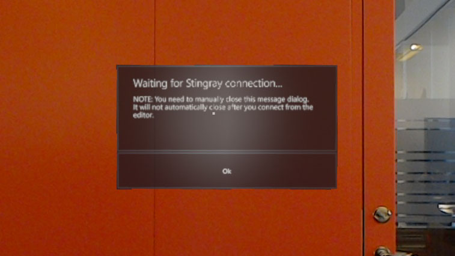

# Get started on HoloLens
**Note: The HoloLens platform is still in development and this page is subject to change.**

**Note: The deployment and editor workflows for HoloLens are partially unfinished. User discretion is advised.**

## Step 1. Building for HoloLens
Building for UWP requires Visual Studio 2015 with the prerequisites stated in the stingray readme file.

Build the uwp32 engine for HoloLens with the console command `ruby make.rb -p hololens`

## Step 2. Deploying to HoloLens

When working on HoloLens you can either add your project data to Visual Studio and deploy it to the device together with the engine executable, or you can deploy the executable without data and then connect to the device from the editor (similar to the workflow that's available for iOS).

A WIP Project for HoloLens testing purposes can be found [here](https://autodesk.box.com/s/xeulzh1f8grwy4t3mmus410jldxlc4w8). (updated **1/27/2017**)

### Bundle project data ###
In order to compile data for UWP/HoloLens in the editor you need to enable experimental editor features (go to File->Settings->Editor Settings and check "Enable experimental editor features").

To compile and bundle the data:

* Open the HoloLens project in the editor, open the Connections panel and right-click on a UWP platform target and select "Compile and Bundle data..." to bundle the game data for the HoloLens. 
* The data will be outputted to the hololens_project_data/uwp_bundled folder next to the project on disk.

### Add project data to package ###
If you want to create an app package with data you need to add the compiled and bundled data to Visual Studio:

* Create a folder called `assets` in the source repo root dir (same folder as make.rb is in)
* Copy the bundled data into this folder
* Re-run make.rb (you can run it with `--no-build` to just generate the solution files)

Alternatively you can add the files to Visual Studio manually:

* Open the uwp32 Visual Studio solution (build/engine/uwp32/stingray_engine_uwp32.sln)
* Add the bundled game data to the "main_uwp" Visual Studio project, and set each item as "Content" by selecting all of them, right-clicking and going into Properties.

### Deploying through Visual Studio ###

There are multiple ways you can proceed:

* If you have the HoloLens Emulator, select "HoloLens Emulator" as Target and run the project.
* If you have the HoloLens connected by USB, select "Device" as Target and run the project.
* Or, to deploy over the network, you can select "Remote Machine" as Target and set the HoloLens IP as the Machine Name on the project debug properties page.

It may take a few minutes for the project to start appropriately on the device.

When deploying to a HoloLens headset the data already on the device is not always cleaned up properly. It´s a good idea to enable "Remove Non-Layout Files from Device" on the project debug properties page in Visual Studio if you have any issues.

### Deploying through Device Portal ###
You can create a complete appx package in Visual Studio that you can install through the Device Portal. This allows you to share an app package with someone who doesn't have access to Visual Studio.

If you want to create a package with data you need to first follow the steps under _Add project data to package_.

* Create an app package with the "Create App Packages" wizard in Visual Studio. You can follow the instructions under the _Create an app package_ title on this page: [Packaging UWP apps](https://docs.microsoft.com/en-us/windows/uwp/packaging/packaging-uwp-apps)

    Select "No" when asked if you want to build a package for uploading to the Windows Store. Skip the validation step at the end of the wizard.
* When the Package is generated you can install it through the HoloLens Device Portal. See this page for information on how to use the Device Portal: [Using the Windows Device Portal](https://developer.microsoft.com/en-us/windows/holographic/using_the_windows_device_portal)

## Step 3. Connect the editor to the device

For more background information, see ~{ Connect to a remote device }~.

**To connect to an HoloLens device:**

1.	Deploy the engine to the device without project data using the steps detailed above.

2.	Start the engine on the device.

	When the app starts up, it shows the following information while it waits for an incoming connection from the Stingray Editor:

	

3.	In the Stingray Editor, use the **Connections** panel (**Window > Deploy and Connect > Connections**) to set up the connection to the IP address for the device, then run project.

	For details, see ~{ Using the Connections panel }~.

>	**Note:** The engine app on the device must be in this waiting state in order for the Stingray Editor to initiate a connection. That means that each time you want to run your project or mirror your viewport, you have to close and restart the engine on the device.

4. You must close the message dialog window on the device manually when connecting for the editor. The window will not close automatically and while it is visible it hides the 3D content rendered by the engine.

### Developer good to know
The Stingray console output is available on the _Logging_ page in the Device Portal under the `Microsoft-Windows-Diagnostics-LoggingChannel` provider.

Useful information for debugging can be available under various different providers. We have found useful information in the `Microsoft-Windows-WindowsErrorReporting`, `-ProcessStateManager` and `-ProcessExitMonitor` providers.
