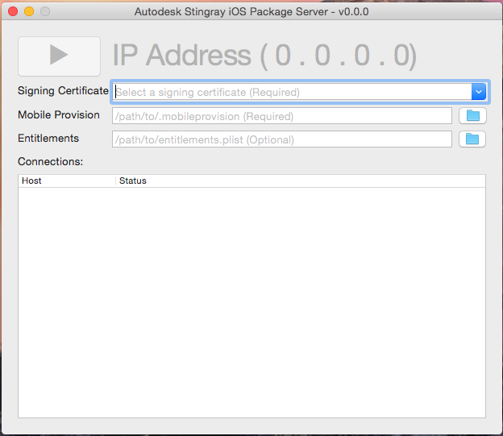
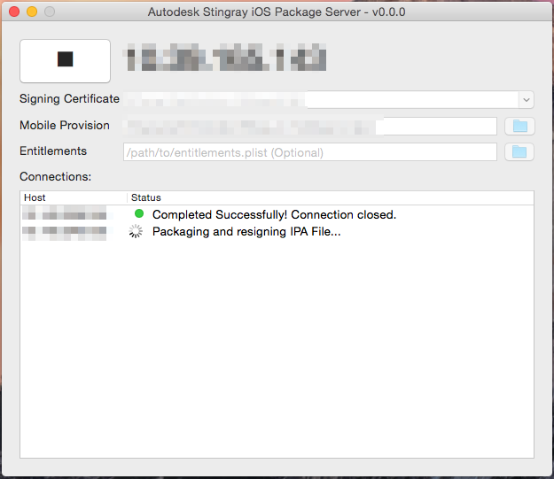
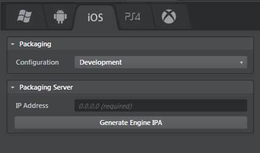
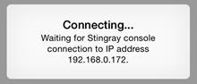
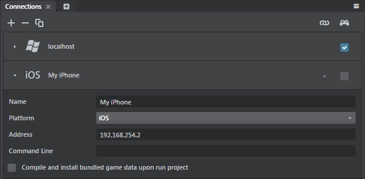
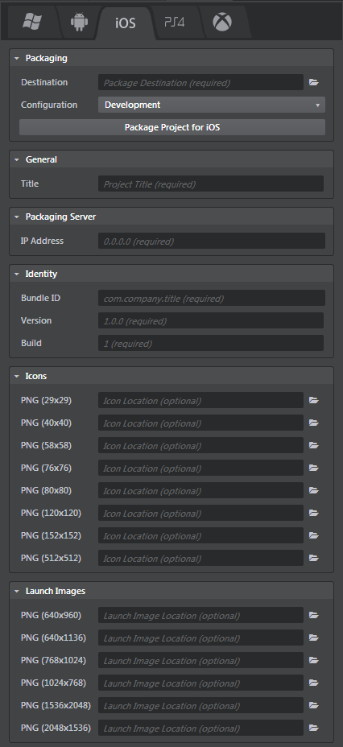

# Get started on iOS

This page tells you everything you need to know in order to get started developing projects for iOS. You'll need an iPhone or iPad to follow along.

## Step 1. Check the supported devices

See the ~{ Supported platforms }~ page for details on the iOS devices and OS versions that the Stingray engine can work with, and make sure your device is a good fit.

## Step 2. First-time setup

You'll have to install and set up a few things on the Windows machine that you use to run the Stingray editor, and your Mac OS X development machine.

### Set up and run the iOS Package Server

The **Stingray iOS Packaging Server** lets you package and re-sign the Stingray engine and your iOS game from your Windows development machine.

Due to restrictions from Apple, the iOS packaging process cannot be fully completed on a Windows machine only. Some steps can only be completed on a computer running Mac OS X. This is where the **Stingray iOS Packaging Server** comes in.

You will need to install and run the server application on a Mac. For system requirements, see ~{ Supported platforms }~.

1.	Locate the packaging app within your Stingray install directory.  For example: `\Program Files\Autodesk\Stingray\<version>\tools\Autodesk Stingray iOS Package Server.app`

2.	Copy the app to the Applications folder on your Mac.

3.	Run the app. The following window appears:

	

4.	Enter the information required to start the server:

	<dl>
	<dt>Signing Certificate</dt>
	<dd>*[Required]* Specifies the certificate you want to use for signing your apps. Note you should use the Distribution certificate when you create a final version of your app that you plan to upload to iTunes Connect.
	 

	> **Note:** The drop-down list shows all certificates installed on the machine. If you don't see anything there, and have to enter the value manually, chances are that you don't have the certificate installed on your machine. This may cause the packaging process to fail.</dd>

	<dt>Mobile Provision</dt>
	<dd>*[Required]* Point to the the mobile provision file associated with your signing certificate. You can download this from your [Apple Developer Center](http://developer.apple.com) page.
	 

	> **Note:** If you're not using an Enterprise provision profile (which lets you install on any device), make sure that you have added the devices you plan to use for testing to this provision profile. If you used Xcode to develop on this device previously, it is automatically added.</dd>

	<dt>Entitlements</dt>
	<dd>*[Optional]* You can set the entitlements file, if desired. If you don't, it is generated automatically. You can generally leave this setting blank.</dd>
	</dl>

5.	Start the server by pressing the play button. (At any time, press the stop button to stop the server.)

	When the server starts, you'll see the IP address that you need to enter in order to generate the IPA for the Stingray engine, and in order to package your game for iOS (see the sections below).

	You will also see a list of all requests coming in from Stingray Editor applications running on your network:

	

	>	**Tip:** Double-click a status message to view the full log data.

### Generate IPA files for the Stingray engine

Stingray doesn't ship with signed versions of the engine runtime ready to use on iOS. You need to generate *.ipa* files for the engine using your own signing certificate.

To generate the engine *.ipa* files:

1.	Set up the iOS Package Server as described above.

2.	In the Stingray Editor on your Windows development machine, open the **Deployer** panel (**Window > Deploy and Connect > Deployer**) to the iOS tab.

	

3.	Select an engine configuration. You'll need to generate the "Development" *.ipa* in order to connect the Stingray Editor to an iOS device for testing, and you'll need to generate the "Release" *.ipa* for your final deployment. See also ~{ About engine configurations }~.

4.	Click **Generate Engine IPA**.

	The file is created and saved in your Windows user directory, typically under `AppData\Local\Autodesk\Stingray\engine\ios\<configuration>`.

Once the *.ipa* file for the engine is available, the **Deployer** panel shows all of the options you can set when you deploy a full standalone build of your game. See [Deploy the project for iOS] below.

## Step 3. Connect the editor to the device

Connecting the editor to your device has two benefits:

-	You can mirror the editor's viewport to the device while you're working on your project content, so that you have a live preview of what your changes look like on the device.

-	You can easily run your project on the device to test your gameplay.

For more background information, see ~{ Connect to a remote device }~.

**To connect to an iOS device:**

1.	Plug your device in to a USB port on your Windows machine.

1.	Install the **development** version of the Stingray engine *.ipa* to the iOS device using iTunes.

	a)	Add the Stingray engine to your iTunes app library. You can either drag and drop it to the **My Apps** area, or select **Add File to Library...** from the main menu.

	b)	Sync your device. iTunes copies the engine app over to the device.

	Always use the **development** version of the engine for this step. The editor can't connect to the **release** version.

1.	Start the engine on the device.

	**NOTE:** The first time you run the Stingray engine on your iOS device, you will probably need to configure iOS to *trust* it. For details, see [this page](https://support.apple.com/en-us/HT204460) from Apple about how to trust a new app developer in your iOS settings.

	When the app starts up, it shows the following information while it waits for an incoming connection from the Stingray Editor:

	

5.	In the Stingray Editor, use the **Connections** panel (**Window > Deploy and Connect > Connections**) to set up the connection to the IP address shown on the device, then mirror or run project.

	

	For details, see ~{ Using the Connections panel }~.

>	**Note:** The engine app on the device must be in this waiting state in order for the Stingray Editor to initiate a connection. That means that each time you want to run your project or mirror your viewport, you have to close and restart the engine on the device.

## Step 4. Deploy the project for iOS

Deploying creates a standalone *.ipa* bundle that you can try out on your device (and, eventually, distribute on the iTunes store). For background information, see ~{ Deploying and Building }~ and ~{ Using the Deployer panel }~.

**To package a project for iOS:**

1.	In the Stingray Editor, open the **Deployer** panel (**Window > Deploy and Connect > Deployer**) to the iOS tab and enter the required information. (See below.)
1.	Click **Package Project for iOS**.

Stingray creates an *.ipa* file for your game, and copies it to the location on your computer that you specify in the **Destination** field.

**After deploying from Stingray:**

-	To copy your deployed game to a connected device for testing, use iTunes.

-	To distribute your game on the Apple iTunes Store, use the tools provided by Apple. See the [App Distribution Guide](https://developer.apple.com/library/ios/documentation/IDEs/Conceptual/AppDistributionGuide/Introduction/Introduction.html).

### iOS deployment settings

You can set the following options in the **Deployer** panel for iOS devices, after you have created the *.ipa* file for the Stingray engine.

### Packaging settings

These settings are common for all tabs. See ~{ Using the Deployer panel }~.

### General settings
<dl>
<dt>Title</dt>
<dd>The title of your project. This is the name used by online stores, and the name that shows up under the app. </dd>
</dl>

### Identity settings
<dl>
<dt>Bundle ID</dt>
<dd>The bundle identifier for your app. Make sure this correlates with the provision profile used to re-sign and the iTunes Connect info.</dd>

<dt>Version</dt>
<dd>The application version string.</dd>

<dt>Build</dt>
<dd>The build number string.</dd>
</dl>

### Icons settings

Icons used for your app. If you leave them empty, the **Deployer** uses the default icon for Autodesk Stingray. When you are ready to release your game, you'll need to specify an icon for each listed size.

### Launch Images settings

The Launch images (splash screens) used for your app. If you leave them empty, the **Deployer** uses a default Autodesk Stingray image. When you are ready to release your game, you'll need to specify an icon for each listed size.

## Step 5. Keep your content optimized!

Mobile devices don't have the same amount of memory and processor resources to throw at your project as your PC does. When you're making a project that you intend to be used on mobile platforms, it's really critical to pay close attention to the size of your resources and the overall demands that the project is putting on the device.

For some helpful tips, see ~{ Optimize memory usage }~.
