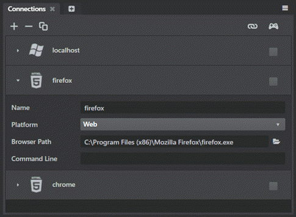
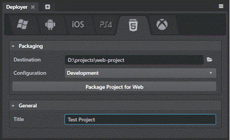

# Get started with Web

These pages tell you everything you need to know in order to get started developing projects that will run in a web browser.

In this release, you can:

-	Launch your project in a browser straight from the Stingray editor.
-	Deploy your project to disk and host it on a web server later on.

You can't yet:

-	Mirror the Stingray editor viewport to the browser.
-	Run the Stingray editor or any of its tools in the browser to edit your levels and projects.

In addition, you may notice that not all of the rendering settings offered by the shading environment are available yet when the project is running in the browser. We're still working on making more of these high-quality effects work under WebGL.

## Step 1. Install a supported browser

Stingray Web requires **both** WebAssembly and WebGL 2.0, which are currently supported by:

-	Google Chrome (Version 57 and above)
-	Mozilla Firefox (Version 52 and above)

## Step 2. Running the project in a web browser

To launch your project in a browser from the Stingray editor, you'll use the **Connections** panel to set up a new web target for each browser you want to use. (See also ~{ Using the Connections panel }~.)

1. In the **Connections** panel (**Window > Deploy and Connect > Connections**), specify a name to identify the connection.

1. Set the **Platform** option to **Web**.

1. The **Browser Path** points to the *.exe* file for your default web browser. If it's not a supported web browser (see the list above), you'll need to browse your file system to select the *.exe* of the supported web browser you want to use.

1. Leave the **Command Line** blank. For web connections, this defines extra parameters that are sent to the launched HTML page in the URL search string. These command-line parameters will be passed to the URL as GET parameters, which are then read by the engine and honored just like any platforms. If you want to customize the HTML page, enter the parameters here. Note that parameters that won’t make sense in the context of a web page might not yield the intended results.

	

1. Press the **Run Project** button either from the **Connections** panel or from the viewport tool bar.

When you get the project successfully running in the browser, it looks something like this:

## Step 3. Deploying the project to disk

To deploy your project to disk (for packaging purposes), you'll use the **Deployer** panel on the **HTML5** icon tab. Set up the requested fields, and click **Package Project for Web**.

	

	See also ~{ Using the Deployer panel }~.

## About the web project output

Whether you are running the project from the Stingray editor or deploying to disk, the same engine binaries will be used for both tasks. However, in the case of deployment, the project data will additionally be bundled, just like other platforms. After deploying, looking into the final deployment folder specified in the **Deployer** panel, you will find:

-	A *.wasm* and a *.js* file that are essentially the result of compiling the engine's runtime into WebAssembly, with some JavaScript glue.

-	An *.html* wrapper that loads the engine's runtime WebAssembly and JavaScript files and instructs it to launch your project. This default page is branded with Stingray logos, but you can customize it freely if you want, or use it as a model to write your own HTML wrapper page.

-	A *scripts* folder that contains additional JavaScript files required to properly initialize the engine. Those can also be configured at will.

-	A *content* folder that contains your project compiled-bundled data.

## About the launch process

Starting up a Stingray project in the browser is a multi-step process. This sequence happens automatically without you needing to do anything, but it can be helpful to know a bit about what's happening behind the scenes.

1.	**Downloading**. In this step, the browser is downloading and compiling the engine's runtime *.wasm* and *.js* files. The actual project data is *not* downloaded in this step.

	The first time you run a project in the browser, this step can take some time to complete. Subsequent launches usually go faster.

	The speed of the connection will affect the time of this step, as well as how fast your CPU can compile the WebAssembly and JavaScript files.

	In order to save time downloading the same content the next time you load the page, Stingray stores the downloaded content in your browser's IndexedDB local storage. (This can speed things up especially if you're running the project on a remote server.) You may find that you need to clear this cache from your browser if you're not seeing updates to your content as expected.

1.	 **Syncing resources**. In this step, your project's data is either downloaded from the remote, or loaded from your browser's IndexedDB local storage.

	The first time you run a project in the browser, all files will not exist in the browser's IndexedDB local storage, so they will all be downloaded from the remote.

	On subsequent launches, most (if not all) files should be found in your IndexedDB local storage, essentially eliminating any downloads from the remote, greatly speeding up this step. Note that every browser imposes different limits on the IndexedDB local storage, so it is entirely possible some larger files or projects may fail to properly persist in the IndexedDB local storage.

1.	**Loading resources**. In this step, the engine is running and actually loading your project's resources into memory.

	The time this step takes to complete depends on the amount of content in your project, and what kinds of resources you're loading.

	For example, materials tend to take a long time to load up, so projects with many materials will have a longer wait here. This is because shaders making up these materials need to be compiled at run-time on this platform, but subsequent runs usually go faster when browsers have shader cache features built in.

## Troubleshooting tips

If your project doesn't run in the browser:

-	Make sure you are using a browser that supports **both** WebAssembly and WebGL 2.0 as specified above.

-	If you have a problem launching from the **Connections** panel, double-check that your **Browser path** points to the *.exe* of your browser and not any other files.

-	In the browser, typically you can press **F12** to open the developer tools.

	The **Console** tab in the developer tools lists any errors the browser encountered when trying to open the project. It also lists any messages that your game project writes to the log. This can sometimes be helpful in diagnosing where a problem occurs.

- Here are some of the errors we've heard about, and how to fix them:

	- **Error:** "Failed to create WebGL 2.0 context"
		**Solution:** Generally this means either your web browser does not support WebGL 2.0, the feature is disabled in its configuration, your video card driver is out-of-date, or your device has more than one graphic adapter and the wrong one is being used by the web browser. In any case, you can always try other web sites to confirm whether WebGL 2.0 works on your computer.

	- **Error:** "Out of memory"
		**Solution:** Too much memory was requested by your project. This happens much more frequently with 32-bit browsers, try a 64-bit web browser instead. Also keep in mind reducing the memory footprint of your project by using texture compression and other techniques always helps as well.

-	Have you run into a different problem? Let us know about it [on the forum](http://www.autodesk.com/stingray-forums).
