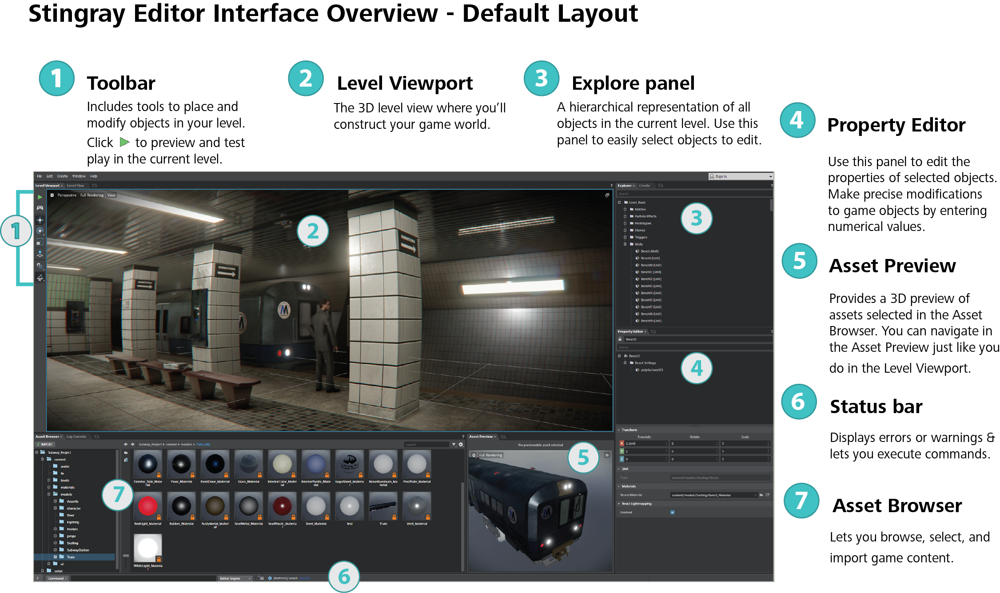

# Interface overview

> **Tip:** As you drag, drop, and rearrange the windows in the Stingray Editor, you can select **Window > Layout > Reset Layout** to restore the interface to this configuration at any time.

---
Related topics:

- ~{ Toolbar }~
- ~{ Level Viewport }~
- ~{ Explorer panel }~
- ~{ Property Editor }~
- ~{ Asset Preview }~
- ~{ Status bar }~
- ~{ Asset Browser }~

---
