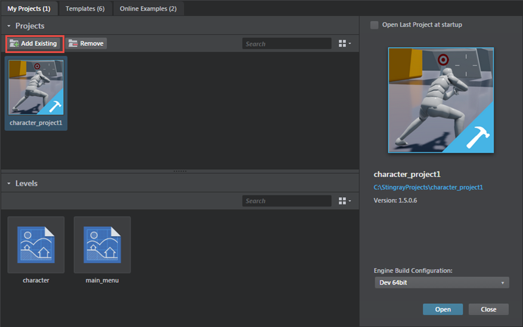

# Open an existing project

The Stingray Editor keeps track of the projects you create and work on. You can easily re-open any project when you launch the editor, or by opening the **Project Manager** from the **File** menu.

 You can also double-click a Stingray project file (`.stingray_project`) to open the project in the Stingray Editor, provided no other projects are running at the moment.

Sometimes, however, you may want to open an existing project that somebody else has created, but that doesn't yet show up in your **Project Manager**. For example, this will happen if you want to open a game kit that you download from Creative Market. See also ~{ Download assets and example projects }~.

**To open an existing project for the first time:**

1.	Open the **Project Manager**. Do this either by launching the Stingray Editor or by selecting **File > Project Manager** from the main menu of the Stingray Editor.

2.	Open the **My Projects** tab.

	

3.	Click **Add Existing** and browse to the location of your project on your local computer. Select the project's resources folder and click **Select Folder**.

	This adds the selected project to the *Projects* area of the **My Projects** tab.

4.	Select the project and click **Open**.
5.	(Optional) If your project was created using an earlier version of Stingray, do one of the following in the dialog box that appears:
	- Click **Yes**.
	 
	Stingray migrates the entity and level files, and opens your project in the Editor. After migration, your project can no longer be opened with older versions of Stingray.

		> **Note:** During migration a .backup file, containing the file's original contents, is created for every migrated file.

		>	**Note:**  A .stingray_project file and a project.settings file are created for each project that you migrate from earlier versions of Stingray.

	- Click **No**.
	 
	Stingray does not migrate your project, and it does not open in the Editor.
