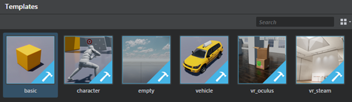

# Template projects

The Stingray Editor ships with a few sample projects to help you get started. By default, template projects install in the **templates** folder in your **Stingray** directory. On a Windows OS templates are installed at the following location: `C:\Program Files\Autodesk\Stingray\<version>\editor\templates`. Templates are also available from the **Project Manager** every time you start Stingray or select **Templates** tab in the **Project Manager**.

>  You can find video walkthroughs of each template <a href="https://www.youtube.com/playlist?list=PLTjhBiJe1i2FMurxvbVZymn2vxC1S-WqU" target="blank">here.</a>

The best way to start a new project is always to clone an existing one, like the Basic project, rather than starting completely from scratch. This ensures you have the correct project structure built in when it's time to compile your game.

If you want to start with nothing in your project, use the `Empty` project to start.

> **Tip:** To change the project thumbnail that displays for your project, replace the thumbnail.png image in the sample project folder. The default project thumbnails are 512 x 512 pixels.

## Basic

This template has a basic level with units and shows simple FX, shaders, and meshes in a simple shading environment.

It also includes a basic script that lets you spawn a free camera and a walk around camera, then swap between the two by pressing F2.

## Character

This template includes a basic shooter level with an animated 3D character. It's set up using Lua script. It has an animation controller, simple character animation examples, and the Lua script in player.lua that shows how they are all hooked up. The character shoots a simple physics-based projectile.

## Empty

This template defaults back to core/appkit and loads minimal level with a simple camera.

## Vehicle

This template is a simple vehicle level. It contains a driveable four-wheeled vehicle and the accompanying Lua script to set up the vehicle and the driving physics.

## VR Template projects

Stingray includes the following templates for rendering in VR devices. (See also: ~{ VR in Stingray }~.)

> **Note:** All of the Stingray VR templates use the mini renderer by default. See ~{ VR content guidelines and the mini renderer }~ for more information.

<dl>
<dt>VR Oculus Touch</dt>
<dd>This template has a simple VR level with a floor plan to walk around in. Currently for Windows only. It also includes a basic script that lets you spawn a free camera and a walk around camera (again, swap the two by pressing F2), and Oculus flow nodes.

Use an Oculus Rift for projects based on this template.

The VR Oculus Touch template supports input from the Oculus Remote and Oculus Touch Controller.

> **Tip:** If the performance is lower for the VR Oculus Touch template projects, make sure that the editor is **not** set to **Update Mode > Always** in the viewport.</dd>

<dt>VR HTC Vive</dt>
<dd>This VR template project is set up to showcase the use of Flow in VR to accomplish various tasks and useful VR interactions. It is recommended to use a higher end machine as this was tested on higher end graphics cards.

Use a Steam VR device to visually interact with the scenes in this template.</dd>

<dt> VR Google</dt>
<dd>This template demonstrates simple usage of the GoogleVR plug-in API for Cardboard and Daydream.

This template supports Google Cardboard for iOS and Android, and Google Daydream with Daydream controller support for Android devices.

Use iOS devices, Android 7.x+ devices like Nexus 9 or a Daydream device like Pixel with this template.
</dd>

<dt> VR Gear</dt>
<dd>This template demonstrates simple usage of the GearVR plug-in API. See ~{ Build a project for Gear VR }~ for more information.</dd>

</dl>
---
Related topics:
-	~{ About the project structure }~
-	~{ Project Manager }~
---
