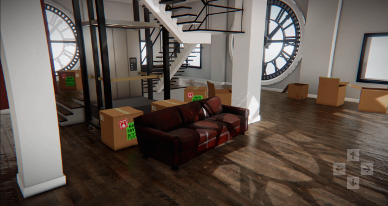
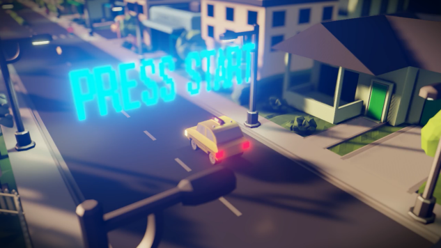
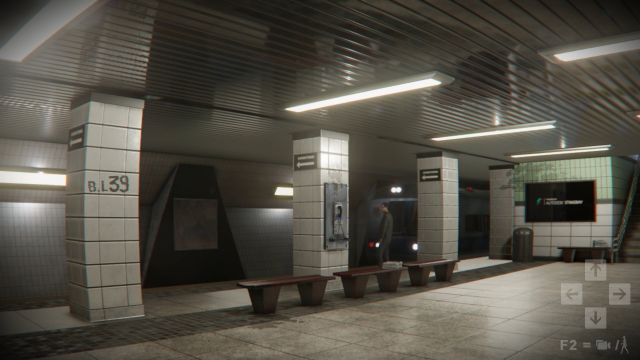

# What is Stingray?

Autodesk® Stingray is a modern game engine designed for architectural viz specialists as well as pro-indie game makers. Providing unmatched connectivity with Maya, Maya LT, and 3ds Max, physically-based rendering, and a full suite of designer-friendly development tools, Stingray simplifies art-to-engine workflows and lets you produce visually stunning games, architectural walkthroughs, and immersive interactive experiences.

Based on the core technology from the proven Bitsquid game engine, Stingray is the ideal authoring tool for anyone looking for an open and flexible interaction engine. Whether you're a game artist, designer, or programmer, Stingray lets you build, step into, and interact with any world that you can imagine.

Starting with a template or sample project, or creating your own project populated with assets built in other apps, Stingray lets you quickly build a world by dragging and dropping assets. With a little Lua scripting, or using the visual node-based **Level Flow** Editor, you can quickly create rules and logic that govern how your world operates, and what are the behaviors and properties that define the objects within it.

Click Play  to enter **Test Level** mode and start to walk through your experience, interacting with the objects you've created. With Stingray, there's no waiting for your scene to render, the scene that you create is always alive. Basic shadows and lighting are built-in by default, and animated assets continually move.

To get started, try any of the following:

- Select **Help > Getting started** and watch the quick start videos.
- Get to know the ~{ Template projects }~.
- Set up your own project. (See ~{ Set up a project }~.)
- Bring in your own assets.
	- ~{ Import an FBX file }~
	- ~{ Interop with Maya, Maya LT, or 3ds Max }~
- Explore and download other content directly from the ~{ Project Manager }~, [the Gamedev portal](https://gamedev.autodesk.com/stingray/plugins), or [Creative Market](https://creativemarket.com/apps/stingray).
- Visit our [community forums](http://www.autodesk.com/stingray-forums)
 to interact with other designers and game makers.

