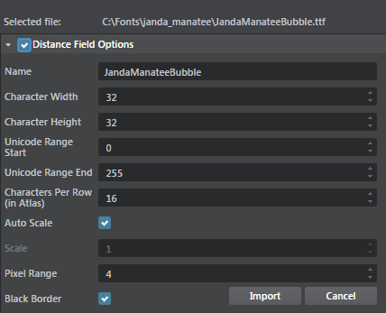

# Import fonts

>Note: Fonts are imported using the **Distance Field Font Import** plug-in which is loaded automatically in the **Plugin Manager**.

1. In the **Asset Browser**, create a folder to save your font files.
2.	Click **Import**, browse to select a font file and click **Open**.
3.	In the window that appears, enable **Distance Field Options**, change the font settings if required and click **Import**.

  

  >Note: Hover over the options in this window for description. For some fonts, you may need to adjust the Character Width and Character Height settings to display with high resolution.

 On import, multi-channel signed distance field resources are generated for the font. You can use the fonts to display text using Lua or the experimental *Stingray GUI 2D Plugin* from the Plugin Manager.
