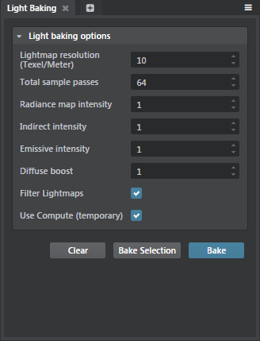
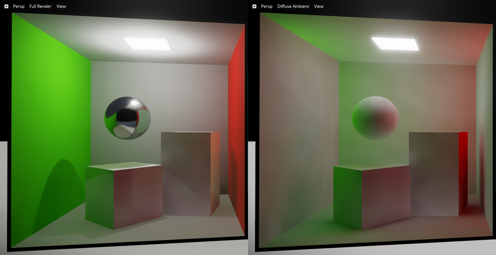

# Bake lightmaps

Whether you want to use Beast or the Stingray baker to generate lightmaps for your level, the general procedure is the same:

1.	Prepare the objects and lights in your level for baking.

	All bake targets need to be set up with secondary UV sets, either in their *.fbx* files or generated automatically by Stingray.

	For each light, set the **Baked** option to determine whether or not the light's direct illumination should be included in the lightmap.

	See ~{ Unwrap UVs for light baking }~ and ~{ Lightmap baking settings }~.

1.	If you have made any changes to your level, units or lights, save the current level before you bake in order to make sure that all of your changes are reflected correctly in the lightmaps. (**File > Save Level**).

1.	Select **Window > Lighting > Bake Lightmaps** from the main menu. Stingray opens the **Bake Lightmaps** window.

	 

1.	In the **Bake Lightmaps** window, set the baking options you want.

	The key option is the **Baker** setting, which controls whether your lightmaps will be baked by Beast or by the Stingray baker. See ~{ About baking with Beast }~ and ~{ About baking with the Stingray baker }~.

	> **Note:** Hover over the other options in this dialog box for descriptions of each attribute.

1.	Click **Bake** to start your baking session.

## Bake results

Stingray creates a new subfolder in the same folder as the current level's *.level* resource file, named `<level_name>-lightmaps`. In this folder, it saves a set of textures that contain the lighting for the bake targets in your scene. The number of lighmaps required is generated automatically, depending on the number of different bake targets in the scene.

Next to your level's resource file, Stingray also creates a *.baked_lighting* resource. This file records the lightmaps generated for your level, and which meshes each map is associated with.

You don't have to do anything with the generated lightmap textures or the *.baked_lighting* file in order for the lightmaps to show up in your game; Stingray handles it automatically. However, you might want to use the ~{ Texture Manager }~ to configure the way the textures are processed and compressed when they are compiled for each platform. Baked lightmaps automatically get tagged with the `Lightmap` texture category, so you can easily find them in the **Texture Editor**.

## Visualizing bake results

The Stingray Editor viewport offers a visualization mode that shows the diffuse lighting that it applies to the objects in the scene. You can use this mode to see the illumination baked into each object's lightmap projected onto that object as a texture.

For example, the image below on the left shows a fully rendered scene. The right shows only the indirect illumination stored in the lightmaps, which clearly shows the green and red colors bleeding from the side walls into the indirect light that shines on the other parts of the scene. (The color bleed is more subtle in the full render due to direct lighting from the overhead light, and due to specular reflections that are drawn from a reflection probe located in the middle of the box, not shown.)

To activate this diffuse visualization mode:

-	From the viewport overlay, click **Full Render > Lighting > Diffuse Ambient**.

If you find artifacts in the way your baked objects are rendered, a good first troubleshooting step is to inspect the UV unwrapping of your objects in the **Level Viewport**. By improving your UV unwrapping, you may be able to eliminate seams and improve resolution. See *View UV unwrapping in the Level Viewport* under ~{ Unwrap UVs for light baking }~.
