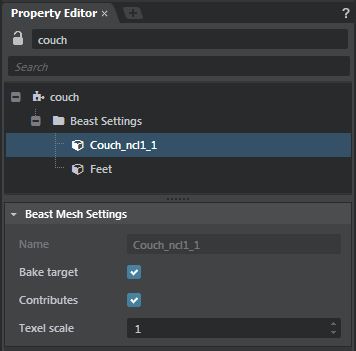

# Lightmap baking settings

The main settings that you'll use to control light baking are found in the **Bake Lightmaps** dialog box (**Window > Lighting > Bake Lightmaps**).

There are also a few other settings to be aware of. Note that most of these settings apply both to Beast and to the Stingray baker.

-	Properties per unit:

	-	Select a unit. In the ~{ Property Editor }~, under the **Lightmap unit settings** group, you will find an **Enabled** checkbox. This option enables or disables baking for all meshes *and* all lights associated with this unit.

-	Properties per mesh:

	-	Each mesh that you bake uses its second UV set (*uv1*) to unwrap its baked lightmaps. Depending on how much space is assigned to each part of your mesh in this UV set, the baked light will have higher or lower resolution. See ~{ Unwrap UVs for light baking }~.

	-	Select a unit. In the tree view of the  ~{ Property Editor }~, under the **Lightmap settings** node, select a mesh to see its additional bake settings.

		

		**Receives**: Enable or disable this option to enable or disable baking a lightmap for this mesh.

		**Contributes**: Determines whether light that bounces off this mesh continues to contribute to lighting other objects in the scene.

		**Resolution multiplier**: Stingray bakes a lightmap for each object, depending on the Resolution multiplier we multiply the global resolution for each object to make each lightmap larger or smaller. The global multiplier is defined in texels per meter. There is no hard set lightmap resolution for objects, it is all based on the global resolution multiplied by each object’s resolution multiplier. See the tooltip for a better explanation.

-	Properties per light. Select a light. In the tree view of the  ~{ Property Editor }~, you'll find its additional bake settings:

	-	Under the **Light** category, the **Baking** setting determines whether or not the light *only* contributes to the baked lightmaps. When set to "Direct & Indirect", the light will contribute to baked direct and indirect light, but will not contribute to real-time dynamic lighting at all. When set to "Indirect", the direct light will still be rendered in realtime.

	-	Under the **Light** category, the **Indirect Intensity** setting adjusts how strongly the indirect light emitted by this light affects nearby surfaces. Used only by Beast, not by the Stingray baker.

-	Global lighting settings in the shading environment. See ~{ Shading environment properties }~.

	-	The texture set for the **Radiance map** will contribute to baked lighting in the scene. Note that when baking, you can multiply the effect of the **Radiance map** by increasing the multiplier in th **Bake lightmaps** window. To generate radiance map for your scene use the Reflection Probe baking workflows.

	-	The **Baked Diffuse Tint** and intensity settings adjust the color and brightness of the baked lightmaps and diffuse probes for all meshes in the scene.

-	The **AO Reflection Occusion Intensity** and **AO Reflection Occlusion Falloff** settings control the intensity and falloff of how the light baked AO will occlude specular lighting.  Adjust these values if the reflection is removing too much of contact shadows in your scene.

-	The **AO Baked Diffuse Intensity** controls the intensity of which the light baked AO will apply to the diffuse lighting. Modify this value if you want more contribution to the diffuse lighting from your light baked AO.
