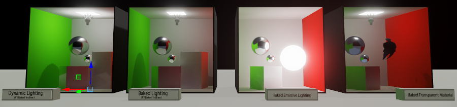
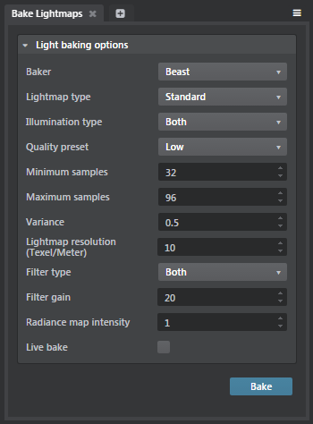

# About baking with Beast

Autodesk Beast is a rendering SDK that simulates lighting and global illumination for games. Stingray comes with a simple, ready-to-use integration of the main lightmap baking features of Beast.

> To see some simple demonstrations of the ways you can set up a Stingray level to use Beast, download the 'Beast Examples' project from the **Online Examples** tab in the ~{ Project Manager }~.

For more information about the Beast SDK, you can find its latest documentation at  <http://www.autodesk.com/beast-sdkdoc-2015-enu>.

## What does it bake?

When baking with Beast, you can control what kind of illumination is stored in the baked lightmaps. The choice you make affects the way the light is applied back to the game at runtime.

### Standard vs. directional lightmaps

*Standard* lightmaps contain simply the amount and color of the incoming illumination that hits each surface. When applied back to the surface in the game, this baked light is applied evenly, regardless of any relief detail stored in the surface's normal maps. Since the light is effectively directionless, the normals of the surface will have no self-shadowing effect. This can cause the surfaces that use the baked light (whether direct, indirect or both) to appear flat.

*Directional* lightmaps also record the dominant direction the illumination is coming from. This allows the light to interact with the normals of the surface, producing the self-shadowing and high-frequency surface detail you expect from normal maps, even for indirect lighting. However, directional lightmaps may produce less clearly defined shadows when you bake direct illumination. They also will take up more space in memory, they will take longer to bake, and they typically take some extra processing at runtime.

### Direct vs. indirect illumination

You can choose what kinds of illumination you want to include in your lightmaps:

-	only the *direct* illumination, which hits the baked surface directly from a light source.

-	only the *indirect* illumination, which hits the baked surface after bouncing off of one or more other surfaces in the scene. This also includes light coming from emissive textures, and environmental light contributed by the sky texture.

-	both direct *and* indirect illumination, combined together in the same texture.

A common approach is to bake only the indirect light, and to let the direct light be applied by the real-time renderer in the game. If you choose this approach, you will probably want to leave the **Baking** option set to "Indirect" for each of the lights in your scene, so that they continue to shine direct light and make dynamic shadows at runtime.

You may, however, want to bake direct illumination in order to get the direct shadows baked into your lightmaps. If you decide to bake the direct illumination, you will need to set the **Baking** option to "Direct & Indirect" for the lights in your scene. This includes the direct light and shadow in the bake, and avoids counting the direct illumination from the light twice: once as part of the baked lightmap, and once again by the real-time renderer on top of the lightmap.

## How does it bake?

The Beast renderer is a separate executable. When you start a baking session in Stingray, it transparently invokes the Beast renderer and sets it up with the geometry in the scene.

The Beast renderer samples the light in the scene multiple times from each texel of each surface, in order to come up with a record of what light is hitting that texel.

Initially, the results tend to be very blocky. The renderer therefore performs an additional filtering pass after all the samples have been collected, which smooths out the results.

## Bake settings

You can use the settings in the **Bake Lightmaps** window to control the way Beast produces its lightmaps.

<dl>

<dt>Lightmap type</dt>
<dd>Determines what kind of information the baked lightmaps contain about the illumination that hits the surface. See [Standard vs. directional lightmaps] above.</dd>

<dt>Illumination type</dt>
<dd>Determines what kind of illumination is baked into the lightmaps. See [Standard vs. directional lightmaps] above.</dd>

<dt>Quality preset</dt>
<dd>Select one of these presets to quickly adjust the settings below to produce low, medium or high quality lightmaps. These presets can give you a good starting point if you're not sure what values to use for the quality settings below.</dd>

<dt>Minimum samples</dt>
<dd>Beast uses adaptive sampling to determine how many samples it should use for each shaded texel. This setting determines the lowest number of samples that Beast will use for any texel. Increasing this value may increase quality, but may also increase baking time.</dd>

<dt>Maximum samples</dt>
<dd>Beast uses adaptive sampling to determine how many samples it should use for each shaded texel. This setting determines the largest number of samples that Beast will use for any texel. Increasing this value may increase quality if your texel scale is large enough to take advantage of the extra detail. However, increasing this value will also increase baking time.</dd>

<dt>Variance</dt>
<dd>A threshold value that determines when enough samples have been collected for a given texel. If the difference in contrast between two adjacent points is greater than this threshold, more points will be created in that area. This results in the algorithm doing more samples where they are really needed: i.e. at shadow boundaries or in areas where the light changes quickly.

Lowering the value of this setting usually increases the number of samples made per texel, which may increase the quality of the result, but also increases baking time.</dd>

<dt>Lightmap resolution (Texel/Meter)</dt>
<dd>Controls the global resolution of the lightmaps produced by the baker in texels per meter.

The Beast will make sure that all surfaces keep the assigned lightmap resolution. Use the resolution multiplier found in the per mesh settings to allow for higher resolution on certain objects in your scene.

Increasing this number will permit the baker to put more detail into each lightmap, which allows room for higher quality, more precise results. However, increasing this value can actually produce noisier results if there are not enough sample passes to achieve that level of detail. Increasing this value also increases the size in memory of each lightmap, and makes each sample pass take longer.</dd>

<dt>Filter type</dt>
<dd>Determines which types of illumination the filtering pass applies to.</dd>

<dt>Filter gain</dt>
<dd>Determines the size of the filter used to blur the initial results. Increasing this value produces smoother results, but increases baking time and may wash out some details, like hard shadows from direct lights.</dd>

<dt>Radiance map intensity</dt>
<dd>Determines how much the radiance map texture contributes to the baked lighting.</dd>

<dt>Live bake</dt>
<dd>Select this option to start a live baking session, in which lower-quality lightmaps are drawn in the viewport as soon as they become available. The bake results are progressively improved, and higher-quality results are automatically reloaded into the viewport.

This mode can help artists and level designers get an idea of the effect of their changes while working on the placement of objects and lights in the level, without waiting for a full bake to complete.

In a live bake, Beast only generates lightmaps for the objects currently framed by the viewport. You typically follow up a live baking session by clicking **Cancel**, unchecking this option, and clicking **Bake** again to start a full baking session for all lightmaps in the level at full quality.
</dd>

</dl>

See also ~{ Lightmap baking settings }~.

## While baking

-	The progress bar in the ~{ Status bar }~ shows the overall progress of the bake. For live baking sessions, it instead shows the progress of each iteration rendering the current viewport.
-	Click **Cancel** to abandon the current baking session, without saving the progress to date.
