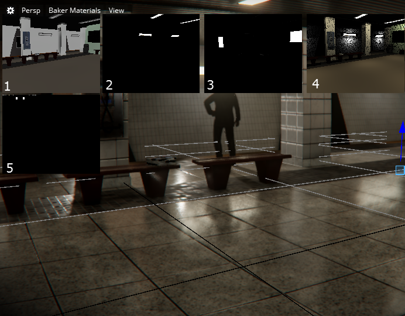

# Light Baker Visualization modes

Light baking is the process of pre-calculating the lighting for the objects in your level and saving it to textures on disk. These textures are called lightmaps. The following visulization modes let you view and debug your lightmaps during the baking process.

The following modes can be enabled by selecting **Full Render > Debug**.

## Baker Full

This is the full path traced solution not using baking. Currently, you must enable a shader in  path_tracing.shader_source for this mode to work.

## Baker materials

The light baker trasfers materials by saving them as low resolution textures. In Baker Materials visualization mode, you can see the scene as the light baker sees it.

When your baking session is active, **Baker Material** mode displays five smaller viewports, showing the following:

<ol>

<li>**Diffuse**: Displays material color.</li>

<li>**Emissive**: Displays materials that glow.</li>

<li>**Transparency**: When surfaces are opaque, they appear black in the viewport. Surfaces that let through blue light appear blue. </li>

<li>**Raytraced**: Shows the scene without global illumination, and with direct light sources only.</li>

<li>**Material-atlas**: All of the small material textures are combined into one big texture, showing how much space the current scene is using.</li>
</ol>
