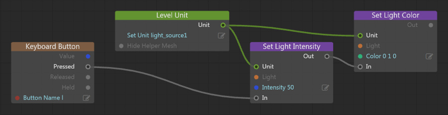

# Change light source properties

You can change the properties of a light source in the Property Editor, in the Story tool, in Flow, or in Lua.

See also ~{ Light source properties }~.

## Property Editor

When you have one or more light sources selected in the viewport or the ~{ Explorer panel }~, you can configure their settings in the Property Editor. Your changes are applied immediately in the editor, and are saved when you save your level.

## Story Editor

You can use the **Story Editor** to create a story that animates the properties of your light. You can key different properties over time in order to simulate different effects, like gradual changes in brightness. When you play your story at runtime by triggering it in your Flow or Lua gameplay code, you'll see the lighting in your level adjust itself accordingly.

See the ~{ Story Editor }~.

## Lua

In your runtime Lua code, you can retrieve an object that represents your light and change its properties on the fly. You retrieve the light object from the unit instance that contains the light you want to change, using the name set for the unit in the Stingray Editor. This may be the "light helper" unit if you created the light in Stingray, or your custom unit if you imported the light into Stingray through an  *.fbx* file.

For example, the following code shows how to set new values for the Intensity and color properties of a light:

~~~{lua}
local new_intensity = 5
local new_color = stingray.Vector3(0, 1, 0) -- green

local light_unit = stingray.World.unit_by_name(SimpleProject.world, "light_source1")
local light_object = stingray.Unit.light(light_unit, "light")
stingray.Light.set_intensity(light_object, new_intensity)
stingray.Light.set_color(light_object, new_color)
~~~

See the functions for the `stingray.Light` object in the Lua API reference.

## Flow

Flow offers a set of built-in nodes for getting and setting the properties of a light source. You can retrieve the light from the unit instance that contains the light you want to change, using the name set for the unit in the Stingray Editor. This may be the "light helper" unit if you created the light in Stingray, or your custom unit if you imported the light into Stingray through an  *.fbx* file.

See the nodes in the **Light** category in the Flow API reference; for example, **Light > Get Light Color** / **Light > Set Light Color**.

For example:

